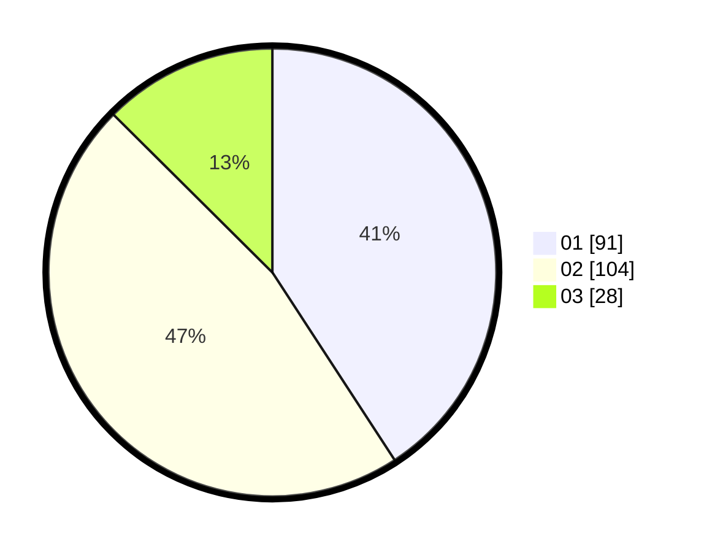

# Hasil

Hasil perolehan suara paslon dapat dilihat pada file paslon-01.txt, paslon-02.txt, dan paslon-03.txt.

Jika tidak ada, artinya data tersebut belum ada pada SIREKAP.

## Perolehan Suara

 * Paslon 01: **91**.
 * Paslon 02: **104**.
 * Paslon 03: **28**.

## Foto C Plano

https://sirekap-obj-formc.kpu.go.id/9196/pemilu/ppwp/31/75/09/10/05/3175091005019-20240214-155055--64870ce2-8c4e-433f-94aa-a5c7e7fa7554.jpg

https://sirekap-obj-formc.kpu.go.id/9196/pemilu/ppwp/31/75/09/10/05/3175091005019-20240214-155117--876c82b2-1fd0-421c-9ef4-62139aecd21b.jpg

https://sirekap-obj-formc.kpu.go.id/9196/pemilu/ppwp/31/75/09/10/05/3175091005019-20240215-210011--de60b0e6-130e-4e25-afd5-a0f7995b33c2.jpg

## DATA PEMILIH TETAP

Jumlah pemilih dalam DPT: **290**.
 * L: **150**.
 * P: **140**.

## DATA PENGGUNA HAK PILIH

Jumlah pengguna hak pilih dalam DPT: **222**.
 * L: **105**.
 * P: **117**.

Jumlah pengguna hak pilih dalam DPTb: **0**.
 * L: **0**.
 * P: **0**.

Jumlah pengguna hak pilih dalam DPK: **4**.
 * L: **2**.
 * P: **2**.

Jumlah pengguna hak pilih: **226**.
 * L: **107**.
 * P: **119**.

## JUMLAH SUARA SAH DAN TIDAK SAH

JUMLAH SELURUH SUARA SAH: **223**.

JUMLAH SUARA TIDAK SAH: **3**.

JUMLAH SELURUH SUARA SAH DAN SUARA TIDAK SAH: **226**.
