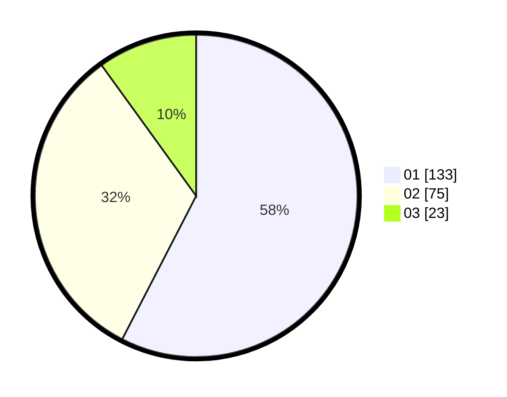

# Hasil

Hasil perolehan suara paslon dapat dilihat pada file paslon-01.txt, paslon-02.txt, dan paslon-03.txt.

Jika tidak ada, artinya data tersebut belum ada pada SIREKAP.

## Perolehan Suara

 * Paslon 01: **133**.
 * Paslon 02: **75**.
 * Paslon 03: **23**.

## Foto C Plano

https://sirekap-obj-formc.kpu.go.id/d3ba/pemilu/ppwp/31/75/09/10/05/3175091005020-20240214-190841--b7c9b7e4-53ca-4df7-bbb5-d5474d304262.jpg

https://sirekap-obj-formc.kpu.go.id/d3ba/pemilu/ppwp/31/75/09/10/05/3175091005020-20240214-191331--f5396000-ef18-4340-917d-87380d723f4b.jpg

https://sirekap-obj-formc.kpu.go.id/d3ba/pemilu/ppwp/31/75/09/10/05/3175091005020-20240214-191954--f679952e-a94f-4df6-8bf3-294584a62721.jpg

## DATA PEMILIH TETAP

Jumlah pemilih dalam DPT: **290**.
 * L: **143**.
 * P: **147**.

## DATA PENGGUNA HAK PILIH

Jumlah pengguna hak pilih dalam DPT: **226**.
 * L: **111**.
 * P: **115**.

Jumlah pengguna hak pilih dalam DPTb: **0**.
 * L: **0**.
 * P: **0**.

Jumlah pengguna hak pilih dalam DPK: **8**.
 * L: **4**.
 * P: **4**.

Jumlah pengguna hak pilih: **234**.
 * L: **115**.
 * P: **119**.

## JUMLAH SUARA SAH DAN TIDAK SAH

JUMLAH SELURUH SUARA SAH: **231**.

JUMLAH SUARA TIDAK SAH: **3**.

JUMLAH SELURUH SUARA SAH DAN SUARA TIDAK SAH: **234**.
