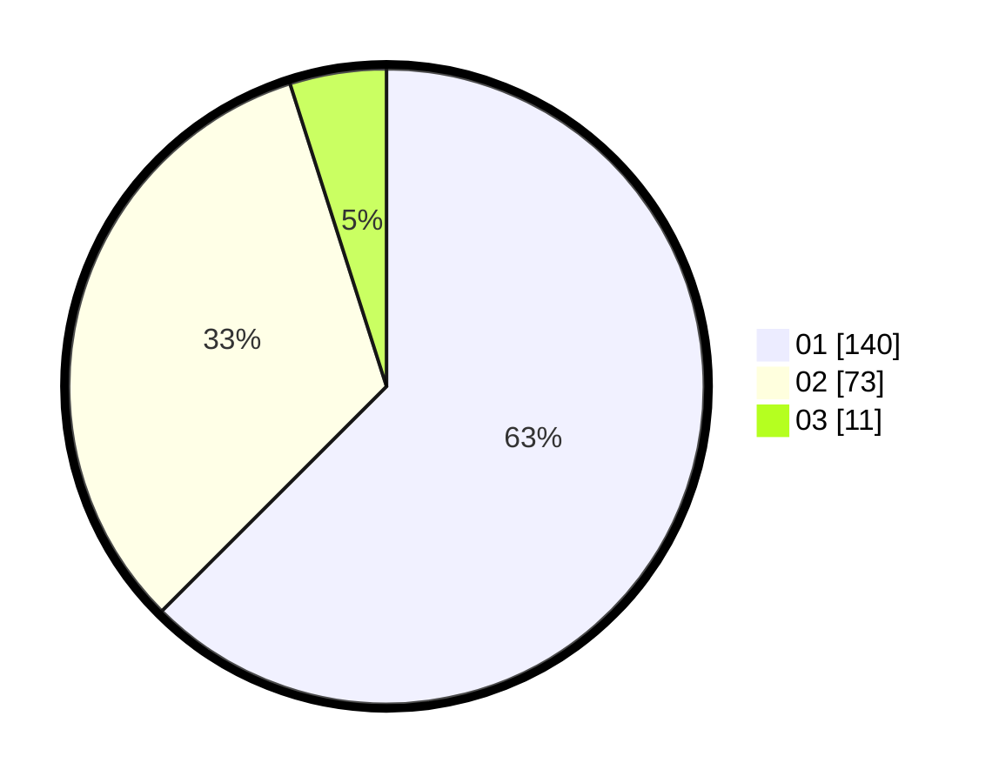

# Hasil

Hasil perolehan suara paslon dapat dilihat pada file paslon-01.txt, paslon-02.txt, dan paslon-03.txt.

Jika tidak ada, artinya data tersebut belum ada pada SIREKAP.

## Perolehan Suara

 * Paslon 01: **140**.
 * Paslon 02: **73**.
 * Paslon 03: **11**.

## Foto C Plano

https://sirekap-obj-formc.kpu.go.id/ebee/pemilu/ppwp/31/75/09/10/05/3175091005024-20240215-004505--3a43c755-d5df-4ce8-bc4c-9524cc1bb25f.jpg

https://sirekap-obj-formc.kpu.go.id/ebee/pemilu/ppwp/31/75/09/10/05/3175091005024-20240215-004606--723c5e26-46ba-49fc-a7a9-2801fda1fd8a.jpg

https://sirekap-obj-formc.kpu.go.id/ebee/pemilu/ppwp/31/75/09/10/05/3175091005024-20240215-004650--2a16ab2a-2e56-4698-a7d5-104f693d0e42.jpg

## DATA PEMILIH TETAP

Jumlah pemilih dalam DPT: **280**.
 * L: **134**.
 * P: **146**.

## DATA PENGGUNA HAK PILIH

Jumlah pengguna hak pilih dalam DPT: **219**.
 * L: **97**.
 * P: **122**.

Jumlah pengguna hak pilih dalam DPTb: **1**.
 * L: **1**.
 * P: **0**.

Jumlah pengguna hak pilih dalam DPK: **5**.
 * L: **3**.
 * P: **2**.

Jumlah pengguna hak pilih: **225**.
 * L: **101**.
 * P: **124**.

## JUMLAH SUARA SAH DAN TIDAK SAH

JUMLAH SELURUH SUARA SAH: **224**.

JUMLAH SUARA TIDAK SAH: **1**.

JUMLAH SELURUH SUARA SAH DAN SUARA TIDAK SAH: **225**.
