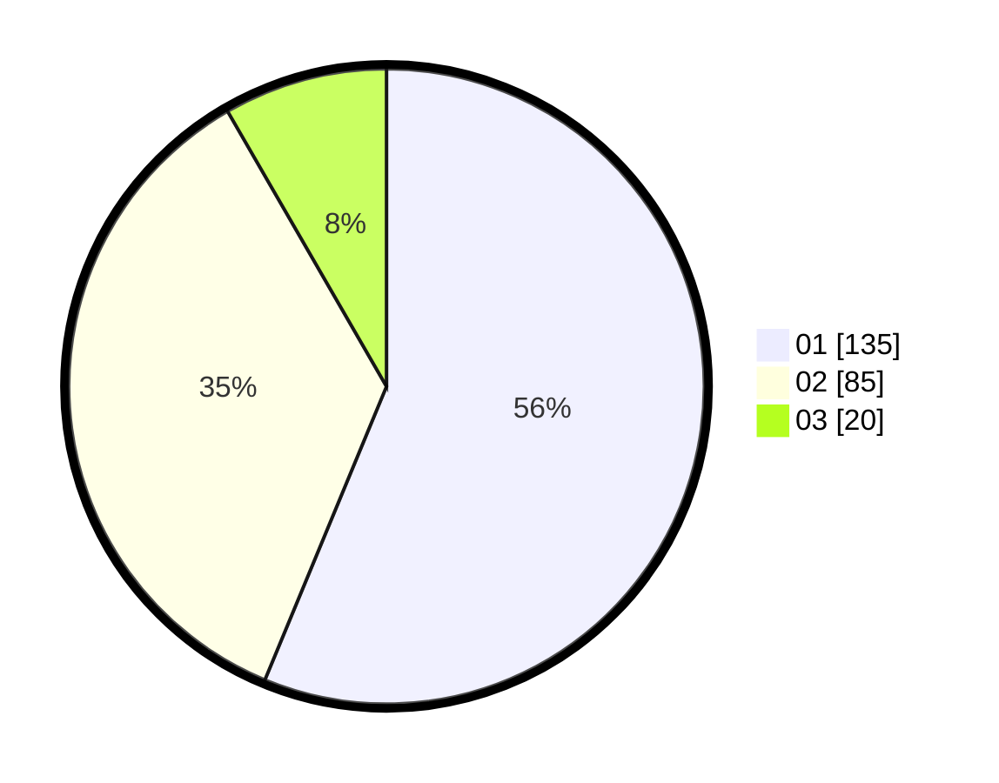

# Hasil

Hasil perolehan suara paslon dapat dilihat pada file paslon-01.txt, paslon-02.txt, dan paslon-03.txt.

Jika tidak ada, artinya data tersebut belum ada pada SIREKAP.

## Perolehan Suara

 * Paslon 01: **135**.
 * Paslon 02: **85**.
 * Paslon 03: **20**.

## Foto C Plano

https://sirekap-obj-formc.kpu.go.id/c4b7/pemilu/ppwp/31/75/09/10/05/3175091005027-20240214-210809--c91ef11f-f889-4292-a983-4054265d1018.jpg

https://sirekap-obj-formc.kpu.go.id/c4b7/pemilu/ppwp/31/75/09/10/05/3175091005027-20240214-155849--ec1e9b88-b472-40a7-ab0d-1bbfaa4b4081.jpg

https://sirekap-obj-formc.kpu.go.id/c4b7/pemilu/ppwp/31/75/09/10/05/3175091005027-20240216-145841--7f04f413-4314-42cc-abb2-eadf2b821b9f.jpg

## DATA PEMILIH TETAP

Jumlah pemilih dalam DPT: **291**.
 * L: **149**.
 * P: **142**.

## DATA PENGGUNA HAK PILIH

Jumlah pengguna hak pilih dalam DPT: **237**.
 * L: **116**.
 * P: **121**.

Jumlah pengguna hak pilih dalam DPTb: **0**.
 * L: **0**.
 * P: **0**.

Jumlah pengguna hak pilih dalam DPK: **4**.
 * L: **3**.
 * P: **1**.

Jumlah pengguna hak pilih: **241**.
 * L: **119**.
 * P: **122**.

## JUMLAH SUARA SAH DAN TIDAK SAH

JUMLAH SELURUH SUARA SAH: **240**.

JUMLAH SUARA TIDAK SAH: **1**.

JUMLAH SELURUH SUARA SAH DAN SUARA TIDAK SAH: **241**.
