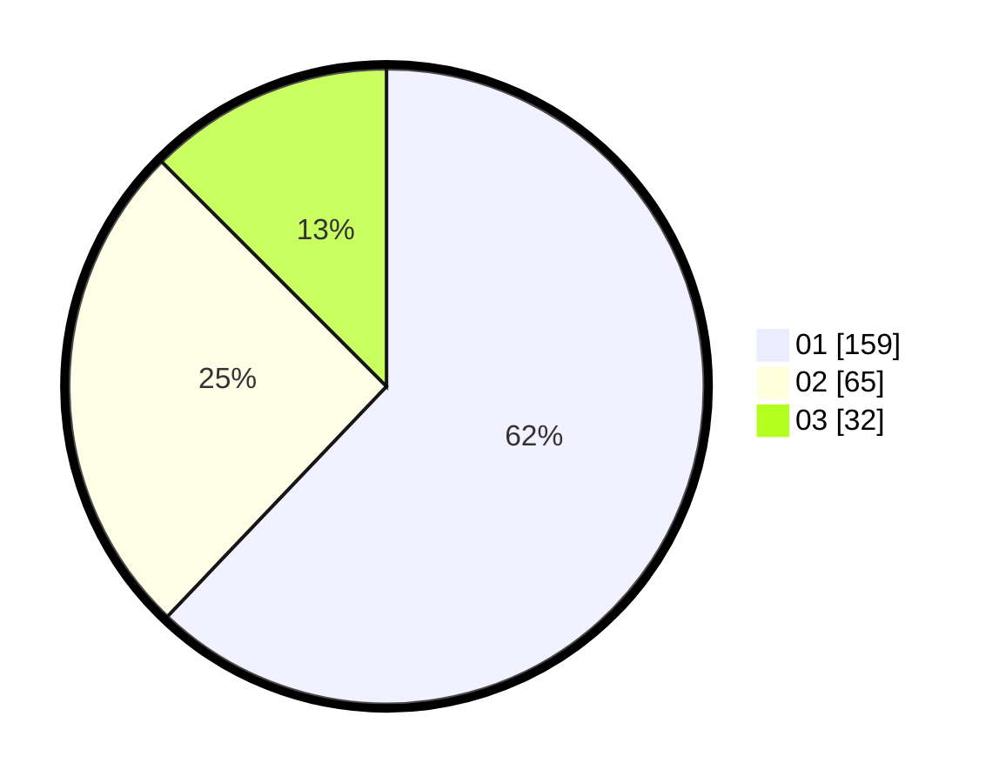

# Hasil

Hasil perolehan suara paslon dapat dilihat pada file paslon-01.txt, paslon-02.txt, dan paslon-03.txt.

Jika tidak ada, artinya data tersebut belum ada pada SIREKAP.

## Perolehan Suara

 * Paslon 01: **159**.
 * Paslon 02: **65**.
 * Paslon 03: **32**.

## Foto C Plano

https://sirekap-obj-formc.kpu.go.id/971c/pemilu/ppwp/31/75/09/10/05/3175091005032-20240214-204916--0f152b0e-c73c-43b6-b897-fa578472236f.jpg

https://sirekap-obj-formc.kpu.go.id/971c/pemilu/ppwp/31/75/09/10/05/3175091005032-20240214-205125--90bf16be-b1b5-4df7-a686-cb3d1ba07cdb.jpg

https://sirekap-obj-formc.kpu.go.id/971c/pemilu/ppwp/31/75/09/10/05/3175091005032-20240214-205205--46e852a4-a7c8-4e0d-80f7-7c01ccffd4b1.jpg

## DATA PEMILIH TETAP

Jumlah pemilih dalam DPT: **287**.
 * L: **147**.
 * P: **140**.

## DATA PENGGUNA HAK PILIH

Jumlah pengguna hak pilih dalam DPT: **252**.
 * L: **127**.
 * P: **125**.

Jumlah pengguna hak pilih dalam DPTb: **3**.
 * L: **1**.
 * P: **2**.

Jumlah pengguna hak pilih dalam DPK: **1**.
 * L: **0**.
 * P: **1**.

Jumlah pengguna hak pilih: **256**.
 * L: **128**.
 * P: **128**.

## JUMLAH SUARA SAH DAN TIDAK SAH

JUMLAH SELURUH SUARA SAH: **256**.

JUMLAH SUARA TIDAK SAH: **0**.

JUMLAH SELURUH SUARA SAH DAN SUARA TIDAK SAH: **256**.
