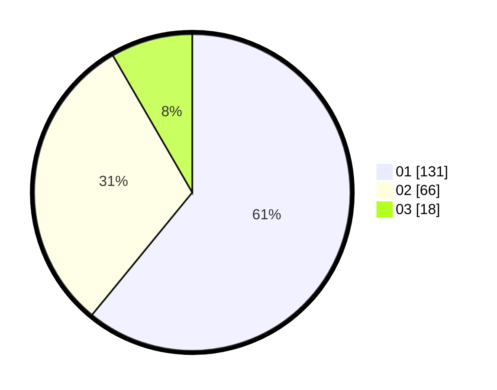

# Hasil

Hasil perolehan suara paslon dapat dilihat pada file paslon-01.txt, paslon-02.txt, dan paslon-03.txt.

Jika tidak ada, artinya data tersebut belum ada pada SIREKAP.

## Perolehan Suara

 * Paslon 01: **131**.
 * Paslon 02: **66**.
 * Paslon 03: **18**.

## Foto C Plano

https://sirekap-obj-formc.kpu.go.id/a580/pemilu/ppwp/31/75/09/10/05/3175091005035-20240214-192034--5f1a77ad-3068-4960-974c-390d277d8fe3.jpg

https://sirekap-obj-formc.kpu.go.id/a580/pemilu/ppwp/31/75/09/10/05/3175091005035-20240214-191124--52e52ddb-fd94-4f96-9c72-10373115805d.jpg

https://sirekap-obj-formc.kpu.go.id/a580/pemilu/ppwp/31/75/09/10/05/3175091005035-20240214-190743--85ca5487-7ec4-4aa8-a925-67456ee798d2.jpg

## DATA PEMILIH TETAP

Jumlah pemilih dalam DPT: **273**.
 * L: **146**.
 * P: **127**.

## DATA PENGGUNA HAK PILIH

Jumlah pengguna hak pilih dalam DPT: **215**.
 * L: **109**.
 * P: **106**.

Jumlah pengguna hak pilih dalam DPTb: **0**.
 * L: **0**.
 * P: **0**.

Jumlah pengguna hak pilih dalam DPK: **3**.
 * L: **2**.
 * P: **1**.

Jumlah pengguna hak pilih: **218**.
 * L: **111**.
 * P: **107**.

## JUMLAH SUARA SAH DAN TIDAK SAH

JUMLAH SELURUH SUARA SAH: **215**.

JUMLAH SUARA TIDAK SAH: **3**.

JUMLAH SELURUH SUARA SAH DAN SUARA TIDAK SAH: **218**.
