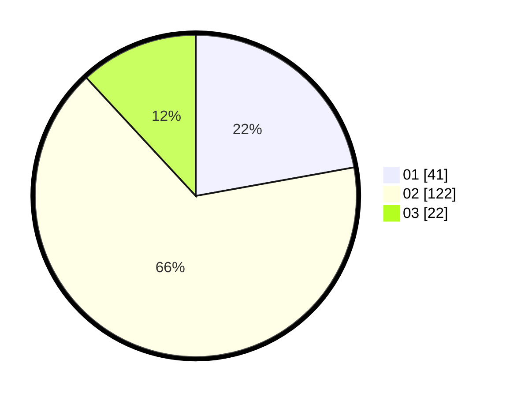

# Hasil

Hasil perolehan suara paslon dapat dilihat pada file paslon-01.txt, paslon-02.txt, dan paslon-03.txt.

Jika tidak ada, artinya data tersebut belum ada pada SIREKAP.

## Perolehan Suara

 * Paslon 01: **41**.
 * Paslon 02: **122**.
 * Paslon 03: **22**.

## Foto C Plano

https://sirekap-obj-formc.kpu.go.id/be12/pemilu/ppwp/31/75/09/10/05/3175091005061-20240214-234355--b4e4db00-ca73-4c2b-b04e-09f3e08c4faa.jpg

https://sirekap-obj-formc.kpu.go.id/be12/pemilu/ppwp/31/75/09/10/05/3175091005061-20240214-211244--8385382d-db0c-45af-bf69-71d40b44125d.jpg

https://sirekap-obj-formc.kpu.go.id/be12/pemilu/ppwp/31/75/09/10/05/3175091005061-20240214-211316--d02b0779-9549-4818-a9a1-f5762f61507e.jpg
