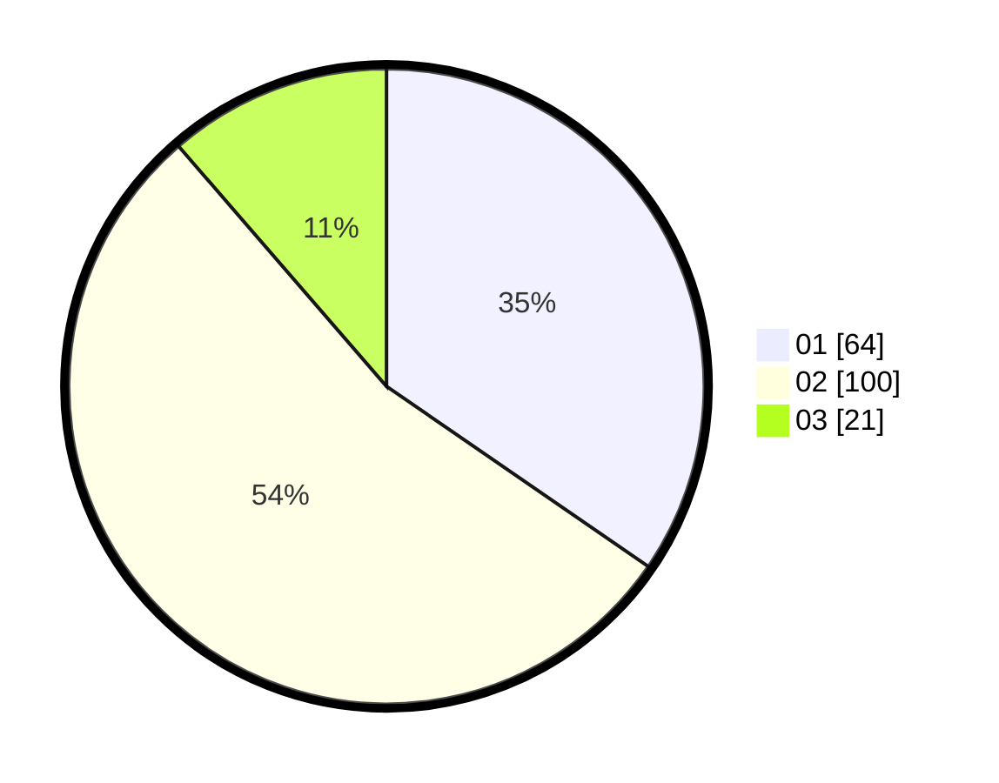

# Hasil

Hasil perolehan suara paslon dapat dilihat pada file paslon-01.txt, paslon-02.txt, dan paslon-03.txt.

Jika tidak ada, artinya data tersebut belum ada pada SIREKAP.

## Perolehan Suara

 * Paslon 01: **64**.
 * Paslon 02: **100**.
 * Paslon 03: **21**.

## Foto C Plano

https://sirekap-obj-formc.kpu.go.id/604b/pemilu/ppwp/31/75/09/10/05/3175091005065-20240215-041449--d0f3ffe7-c22d-424c-a10b-4a367fb644cb.jpg

https://sirekap-obj-formc.kpu.go.id/604b/pemilu/ppwp/31/75/09/10/05/3175091005065-20240214-191125--a7059f0d-17d6-44d2-8794-d3dca81b68e7.jpg

https://sirekap-obj-formc.kpu.go.id/604b/pemilu/ppwp/31/75/09/10/05/3175091005065-20240214-155542--240f94a5-ad85-4b17-a5ff-063c409eba52.jpg

## DATA PEMILIH TETAP

Jumlah pemilih dalam DPT: **252**.
 * L: **114**.
 * P: **138**.

## DATA PENGGUNA HAK PILIH

Jumlah pengguna hak pilih dalam DPT: **183**.
 * L: **78**.
 * P: **105**.

Jumlah pengguna hak pilih dalam DPTb: **4**.
 * L: **3**.
 * P: **1**.

Jumlah pengguna hak pilih dalam DPK: **1**.
 * L: **1**.
 * P: **0**.

Jumlah pengguna hak pilih: **188**.
 * L: **82**.
 * P: **106**.

## JUMLAH SUARA SAH DAN TIDAK SAH

JUMLAH SELURUH SUARA SAH: **185**.

JUMLAH SUARA TIDAK SAH: **3**.

JUMLAH SELURUH SUARA SAH DAN SUARA TIDAK SAH: **188**.
