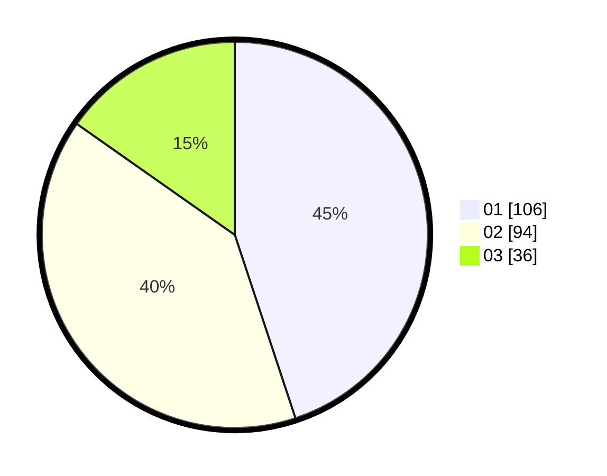

# Hasil

Hasil perolehan suara paslon dapat dilihat pada file paslon-01.txt, paslon-02.txt, dan paslon-03.txt.

Jika tidak ada, artinya data tersebut belum ada pada SIREKAP.

## Perolehan Suara

 * Paslon 01: **106**.
 * Paslon 02: **94**.
 * Paslon 03: **36**.

## Foto C Plano

https://sirekap-obj-formc.kpu.go.id/a293/pemilu/ppwp/31/75/09/10/05/3175091005077-20240215-191822--57bbc203-0b0c-4414-ae38-16983fc6416e.jpg

https://sirekap-obj-formc.kpu.go.id/a293/pemilu/ppwp/31/75/09/10/05/3175091005077-20240215-191849--e06e2515-8301-4bbf-857c-429d5f23efeb.jpg

https://sirekap-obj-formc.kpu.go.id/a293/pemilu/ppwp/31/75/09/10/05/3175091005077-20240215-191900--b15dbe27-ec91-4818-91aa-0fdc3a641888.jpg

## DATA PEMILIH TETAP

Jumlah pemilih dalam DPT: **276**.
 * L: **138**.
 * P: **138**.

## DATA PENGGUNA HAK PILIH

Jumlah pengguna hak pilih dalam DPT: **236**.
 * L: **119**.
 * P: **117**.

Jumlah pengguna hak pilih dalam DPTb: **1**.
 * L: **0**.
 * P: **1**.

Jumlah pengguna hak pilih dalam DPK: **0**.
 * L: **0**.
 * P: **0**.

Jumlah pengguna hak pilih: **237**.
 * L: **119**.
 * P: **118**.

## JUMLAH SUARA SAH DAN TIDAK SAH

JUMLAH SELURUH SUARA SAH: **236**.

JUMLAH SUARA TIDAK SAH: **1**.

JUMLAH SELURUH SUARA SAH DAN SUARA TIDAK SAH: **237**.
