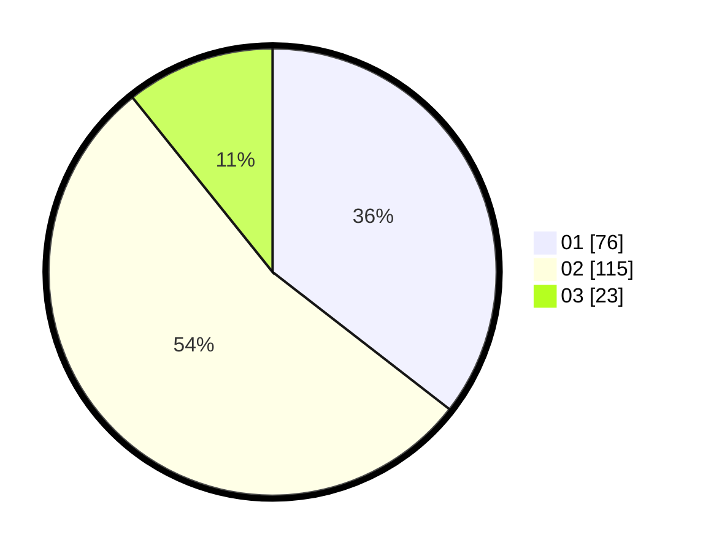

# Hasil

Hasil perolehan suara paslon dapat dilihat pada file paslon-01.txt, paslon-02.txt, dan paslon-03.txt.

Jika tidak ada, artinya data tersebut belum ada pada SIREKAP.

## Perolehan Suara

 * Paslon 01: **76**.
 * Paslon 02: **115**.
 * Paslon 03: **23**.

## Foto C Plano

https://sirekap-obj-formc.kpu.go.id/4989/pemilu/ppwp/31/75/09/10/05/3175091005079-20240215-113532--78628747-e224-4efd-8537-643cbd998cad.jpg

https://sirekap-obj-formc.kpu.go.id/4989/pemilu/ppwp/31/75/09/10/05/3175091005079-20240215-113602--1d39b2a1-3b89-43c2-8c35-6bccce90a466.jpg

https://sirekap-obj-formc.kpu.go.id/4989/pemilu/ppwp/31/75/09/10/05/3175091005079-20240215-010739--313f0f9f-1f72-40b4-ba3f-c88f257e22a3.jpg

## DATA PEMILIH TETAP

Jumlah pemilih dalam DPT: **278**.
 * L: **144**.
 * P: **134**.

## DATA PENGGUNA HAK PILIH

Jumlah pengguna hak pilih dalam DPT: **217**.
 * L: **107**.
 * P: **110**.

Jumlah pengguna hak pilih dalam DPTb: **0**.
 * L: **0**.
 * P: **0**.

Jumlah pengguna hak pilih dalam DPK: **2**.
 * L: **1**.
 * P: **1**.

Jumlah pengguna hak pilih: **219**.
 * L: **108**.
 * P: **111**.

## JUMLAH SUARA SAH DAN TIDAK SAH

JUMLAH SELURUH SUARA SAH: **214**.

JUMLAH SUARA TIDAK SAH: **5**.

JUMLAH SELURUH SUARA SAH DAN SUARA TIDAK SAH: **219**.
