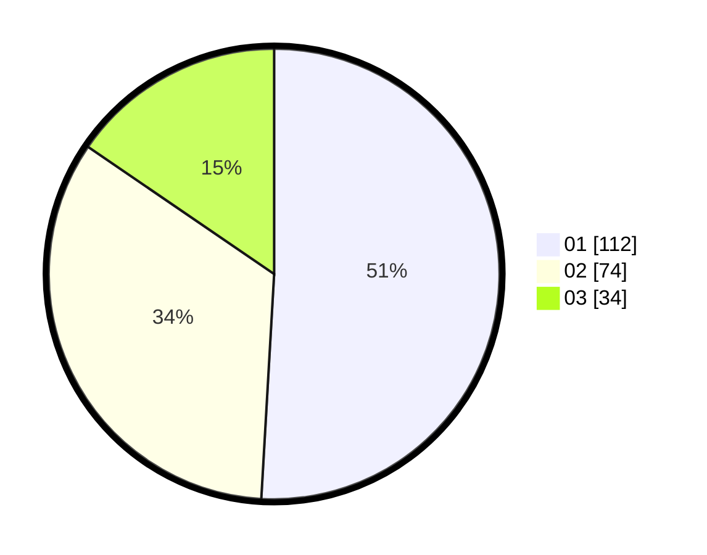

# Hasil

Hasil perolehan suara paslon dapat dilihat pada file paslon-01.txt, paslon-02.txt, dan paslon-03.txt.

Jika tidak ada, artinya data tersebut belum ada pada SIREKAP.

## Perolehan Suara

 * Paslon 01: **112**.
 * Paslon 02: **74**.
 * Paslon 03: **34**.

## Foto C Plano

https://sirekap-obj-formc.kpu.go.id/a1a6/pemilu/ppwp/31/75/09/10/05/3175091005084-20240215-002903--76dd14ab-fdb7-4665-bfa8-ba341fcb6ca9.jpg

https://sirekap-obj-formc.kpu.go.id/a1a6/pemilu/ppwp/31/75/09/10/05/3175091005084-20240215-002929--20286f8b-84b4-441a-9042-dcd77fc27ed8.jpg

https://sirekap-obj-formc.kpu.go.id/a1a6/pemilu/ppwp/31/75/09/10/05/3175091005084-20240215-003045--861d850c-ee84-4d62-ad05-0da37b339b0c.jpg

## DATA PEMILIH TETAP

Jumlah pemilih dalam DPT: **249**.
 * L: **127**.
 * P: **122**.

## DATA PENGGUNA HAK PILIH

Jumlah pengguna hak pilih dalam DPT: **249**.
 * L: **127**.
 * P: **122**.

Jumlah pengguna hak pilih dalam DPTb: **6**.
 * L: **5**.
 * P: **1**.

Jumlah pengguna hak pilih dalam DPK: **0**.
 * L: **0**.
 * P: **0**.

Jumlah pengguna hak pilih: **255**.
 * L: **132**.
 * P: **123**.

## JUMLAH SUARA SAH DAN TIDAK SAH

JUMLAH SELURUH SUARA SAH: **220**.

JUMLAH SUARA TIDAK SAH: **4**.

JUMLAH SELURUH SUARA SAH DAN SUARA TIDAK SAH: **224**.
