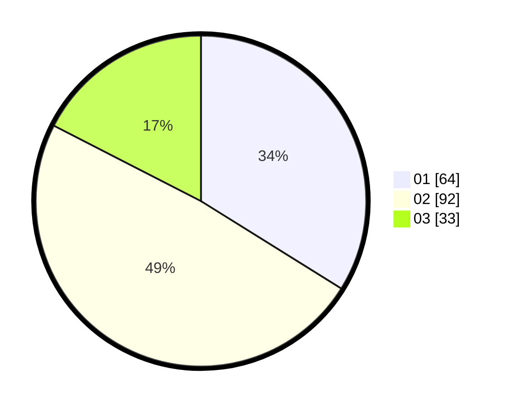

# Hasil

Hasil perolehan suara paslon dapat dilihat pada file paslon-01.txt, paslon-02.txt, dan paslon-03.txt.

Jika tidak ada, artinya data tersebut belum ada pada SIREKAP.

## Perolehan Suara

 * Paslon 01: **64**.
 * Paslon 02: **92**.
 * Paslon 03: **33**.

## Foto C Plano

https://sirekap-obj-formc.kpu.go.id/d229/pemilu/ppwp/31/75/09/10/05/3175091005087-20240216-133930--6c899381-9bdb-43bb-a071-c253a151b1df.jpg

https://sirekap-obj-formc.kpu.go.id/d229/pemilu/ppwp/31/75/09/10/05/3175091005087-20240216-133931--f355d3b7-c105-4bdb-a78a-3acef1ffb47c.jpg

https://sirekap-obj-formc.kpu.go.id/d229/pemilu/ppwp/31/75/09/10/05/3175091005087-20240216-133931--b6c8ae8c-f9ac-49ce-a6d7-8e9836ea0e5a.jpg

## DATA PEMILIH TETAP

Jumlah pemilih dalam DPT: **253**.
 * L: **130**.
 * P: **123**.

## DATA PENGGUNA HAK PILIH

Jumlah pengguna hak pilih dalam DPT: **190**.
 * L: **100**.
 * P: **90**.

Jumlah pengguna hak pilih dalam DPTb: **0**.
 * L: **0**.
 * P: **0**.

Jumlah pengguna hak pilih dalam DPK: **0**.
 * L: **0**.
 * P: **0**.

Jumlah pengguna hak pilih: **190**.
 * L: **100**.
 * P: **90**.

## JUMLAH SUARA SAH DAN TIDAK SAH

JUMLAH SELURUH SUARA SAH: **189**.

JUMLAH SUARA TIDAK SAH: **1**.

JUMLAH SELURUH SUARA SAH DAN SUARA TIDAK SAH: **190**.
