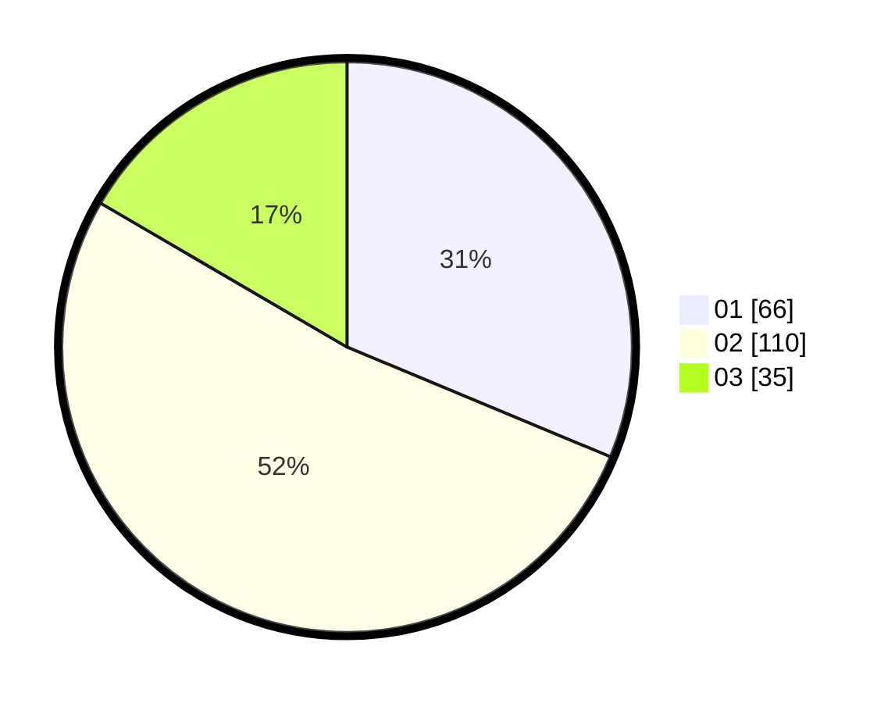

# Hasil

Hasil perolehan suara paslon dapat dilihat pada file paslon-01.txt, paslon-02.txt, dan paslon-03.txt.

Jika tidak ada, artinya data tersebut belum ada pada SIREKAP.

## Perolehan Suara

 * Paslon 01: **66**.
 * Paslon 02: **110**.
 * Paslon 03: **35**.

## Foto C Plano

https://sirekap-obj-formc.kpu.go.id/114d/pemilu/ppwp/31/75/09/10/05/3175091005088-20240216-153336--ee5c0446-61c2-4e72-9bc8-605e2b8020ef.jpg

https://sirekap-obj-formc.kpu.go.id/114d/pemilu/ppwp/31/75/09/10/05/3175091005088-20240216-153337--1cf9876c-0524-4e26-a746-741f32ee6dda.jpg

https://sirekap-obj-formc.kpu.go.id/114d/pemilu/ppwp/31/75/09/10/05/3175091005088-20240216-153336--6f3ef018-6509-4cd8-b261-7b878eb0db8a.jpg

## DATA PEMILIH TETAP

Jumlah pemilih dalam DPT: **265**.
 * L: **130**.
 * P: **135**.

## DATA PENGGUNA HAK PILIH

Jumlah pengguna hak pilih dalam DPT: **206**.
 * L: **99**.
 * P: **107**.

Jumlah pengguna hak pilih dalam DPTb: **5**.
 * L: **3**.
 * P: **2**.

Jumlah pengguna hak pilih dalam DPK: **0**.
 * L: **0**.
 * P: **0**.

Jumlah pengguna hak pilih: **211**.
 * L: **102**.
 * P: **109**.

## JUMLAH SUARA SAH DAN TIDAK SAH

JUMLAH SELURUH SUARA SAH: **211**.

JUMLAH SUARA TIDAK SAH: **0**.

JUMLAH SELURUH SUARA SAH DAN SUARA TIDAK SAH: **211**.
