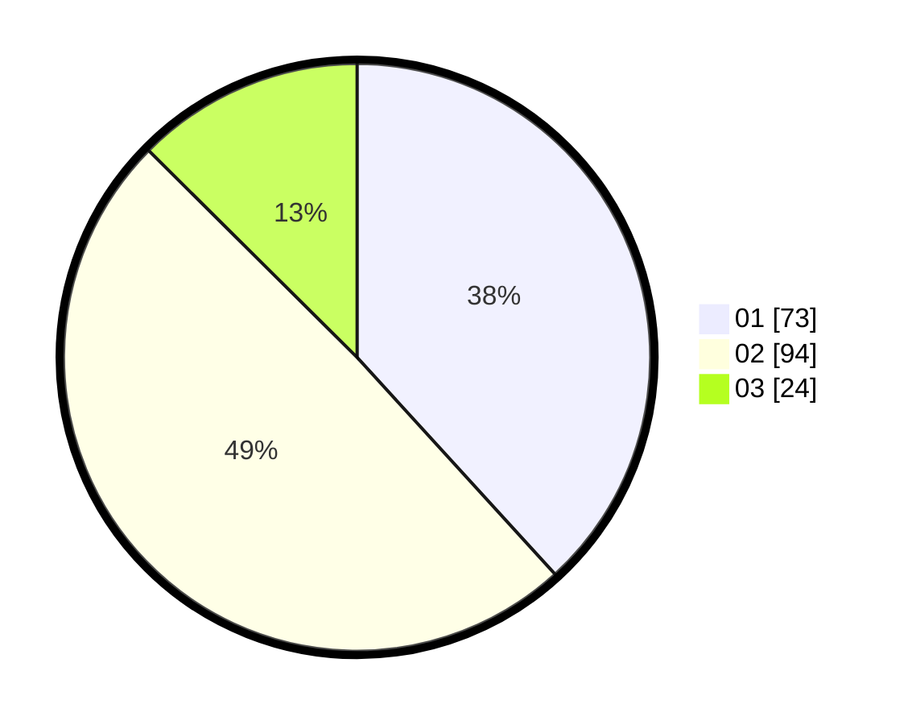

# Hasil

Hasil perolehan suara paslon dapat dilihat pada file paslon-01.txt, paslon-02.txt, dan paslon-03.txt.

Jika tidak ada, artinya data tersebut belum ada pada SIREKAP.

## Perolehan Suara

 * Paslon 01: **73**.
 * Paslon 02: **94**.
 * Paslon 03: **24**.

## Foto C Plano

https://sirekap-obj-formc.kpu.go.id/44d7/pemilu/ppwp/31/75/09/10/05/3175091005089-20240216-152614--17b3c5ea-fa2c-4b79-b519-36dd7d5b2a4b.jpg

https://sirekap-obj-formc.kpu.go.id/44d7/pemilu/ppwp/31/75/09/10/05/3175091005089-20240214-141436--c8ebe2c6-3a19-400b-92b5-035f8fbfefdc.jpg

https://sirekap-obj-formc.kpu.go.id/44d7/pemilu/ppwp/31/75/09/10/05/3175091005089-20240214-141623--99ca50c4-89e2-475b-8c60-aeec4d6b59a8.jpg

## DATA PEMILIH TETAP

Jumlah pemilih dalam DPT: **257**.
 * L: **131**.
 * P: **126**.

## DATA PENGGUNA HAK PILIH

Jumlah pengguna hak pilih dalam DPT: **193**.
 * L: **93**.
 * P: **100**.

Jumlah pengguna hak pilih dalam DPTb: **0**.
 * L: **0**.
 * P: **0**.

Jumlah pengguna hak pilih dalam DPK: **1**.
 * L: **0**.
 * P: **1**.

Jumlah pengguna hak pilih: **194**.
 * L: **93**.
 * P: **101**.

## JUMLAH SUARA SAH DAN TIDAK SAH

JUMLAH SELURUH SUARA SAH: **191**.

JUMLAH SUARA TIDAK SAH: **3**.

JUMLAH SELURUH SUARA SAH DAN SUARA TIDAK SAH: **194**.
