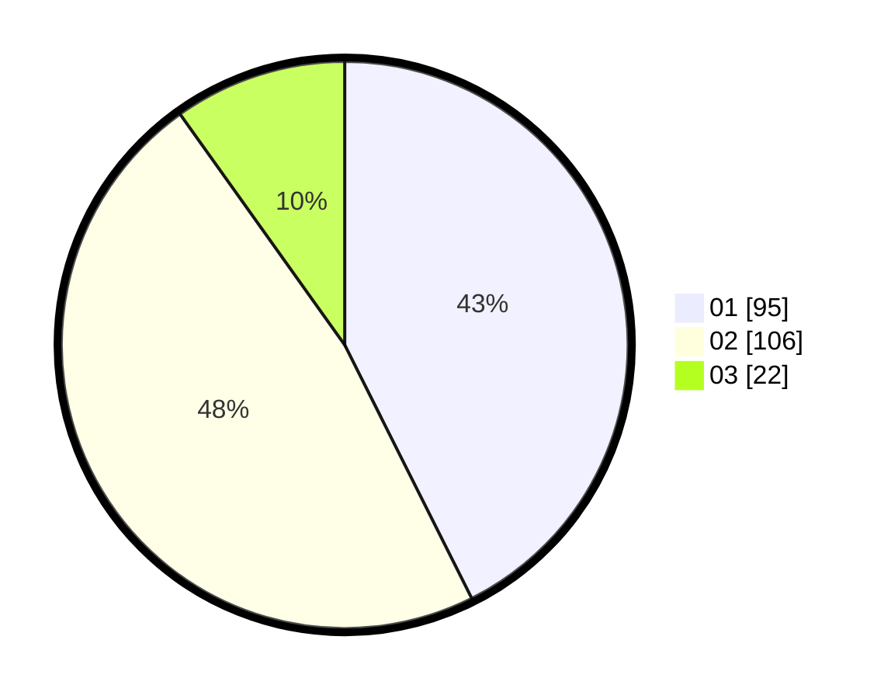

# Hasil

Hasil perolehan suara paslon dapat dilihat pada file paslon-01.txt, paslon-02.txt, dan paslon-03.txt.

Jika tidak ada, artinya data tersebut belum ada pada SIREKAP.

## Perolehan Suara

 * Paslon 01: **95**.
 * Paslon 02: **106**.
 * Paslon 03: **22**.

## Foto C Plano

https://sirekap-obj-formc.kpu.go.id/099f/pemilu/ppwp/31/75/09/10/05/3175091005094-20240214-212857--1c305480-13d4-4c37-8e8e-e669f82f916e.jpg

https://sirekap-obj-formc.kpu.go.id/099f/pemilu/ppwp/31/75/09/10/05/3175091005094-20240214-214052--acc32bf3-1e06-4285-8272-da35c10a0058.jpg

https://sirekap-obj-formc.kpu.go.id/099f/pemilu/ppwp/31/75/09/10/05/3175091005094-20240214-214159--0767ab36-4d75-4708-b04c-1d85ecde700e.jpg
