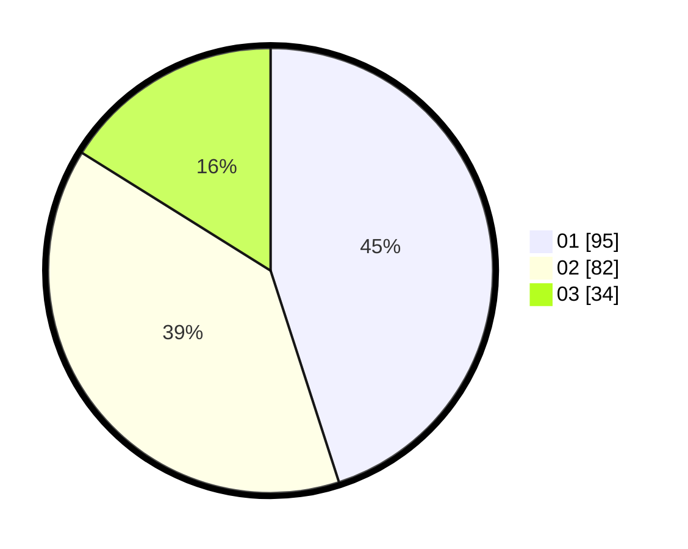

# Hasil

Hasil perolehan suara paslon dapat dilihat pada file paslon-01.txt, paslon-02.txt, dan paslon-03.txt.

Jika tidak ada, artinya data tersebut belum ada pada SIREKAP.

## Perolehan Suara

 * Paslon 01: **95**.
 * Paslon 02: **82**.
 * Paslon 03: **34**.

## Foto C Plano

https://sirekap-obj-formc.kpu.go.id/0b00/pemilu/ppwp/31/75/09/10/05/3175091005095-20240216-135115--6182d548-1a0a-46d9-8d5f-de9d55425609.jpg

https://sirekap-obj-formc.kpu.go.id/0b00/pemilu/ppwp/31/75/09/10/05/3175091005095-20240216-135116--e572c9f4-6abf-4239-9c87-5649aa87c5f3.jpg

https://sirekap-obj-formc.kpu.go.id/0b00/pemilu/ppwp/31/75/09/10/05/3175091005095-20240216-135115--ea191e1a-2789-455b-b3f5-8855c683cb69.jpg

## DATA PEMILIH TETAP

Jumlah pemilih dalam DPT: **254**.
 * L: **117**.
 * P: **137**.

## DATA PENGGUNA HAK PILIH

Jumlah pengguna hak pilih dalam DPT: **219**.
 * L: **98**.
 * P: **121**.

Jumlah pengguna hak pilih dalam DPTb: **1**.
 * L: **0**.
 * P: **1**.

Jumlah pengguna hak pilih dalam DPK: **0**.
 * L: **0**.
 * P: **0**.

Jumlah pengguna hak pilih: **220**.
 * L: **98**.
 * P: **122**.

## JUMLAH SUARA SAH DAN TIDAK SAH

JUMLAH SELURUH SUARA SAH: **211**.

JUMLAH SUARA TIDAK SAH: **9**.

JUMLAH SELURUH SUARA SAH DAN SUARA TIDAK SAH: **220**.
