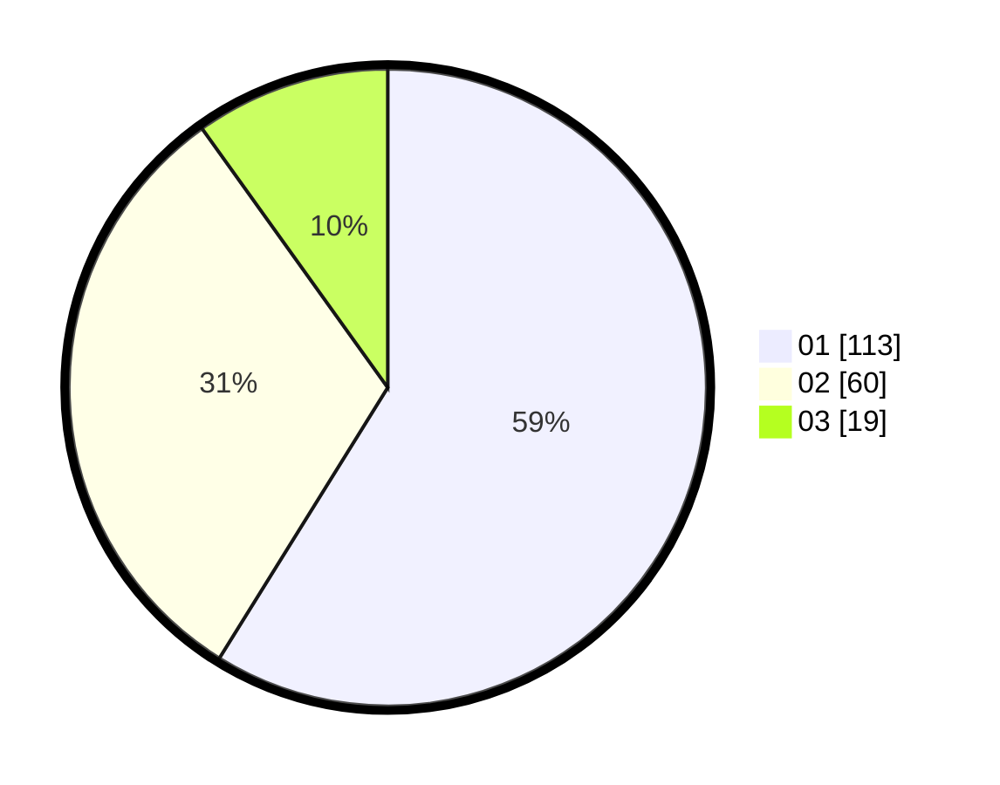

# Hasil

Hasil perolehan suara paslon dapat dilihat pada file paslon-01.txt, paslon-02.txt, dan paslon-03.txt.

Jika tidak ada, artinya data tersebut belum ada pada SIREKAP.

## Perolehan Suara

 * Paslon 01: **113**.
 * Paslon 02: **60**.
 * Paslon 03: **19**.

## Foto C Plano

https://sirekap-obj-formc.kpu.go.id/c4f4/pemilu/ppwp/31/75/09/10/05/3175091005098-20240216-031413--857cab3b-94ae-43fe-865a-f61aabe967f7.jpg

https://sirekap-obj-formc.kpu.go.id/c4f4/pemilu/ppwp/31/75/09/10/05/3175091005098-20240216-031428--b06346a0-54fb-4343-81d3-f6385ff0131a.jpg

https://sirekap-obj-formc.kpu.go.id/c4f4/pemilu/ppwp/31/75/09/10/05/3175091005098-20240216-065057--2b745853-7f8d-461d-a03f-c81889bcce5e.jpg

## DATA PEMILIH TETAP

Jumlah pemilih dalam DPT: **249**.
 * L: **116**.
 * P: **133**.

## DATA PENGGUNA HAK PILIH

Jumlah pengguna hak pilih dalam DPT: **191**.
 * L: **89**.
 * P: **102**.

Jumlah pengguna hak pilih dalam DPTb: **1**.
 * L: **0**.
 * P: **1**.

Jumlah pengguna hak pilih dalam DPK: **0**.
 * L: **0**.
 * P: **0**.

Jumlah pengguna hak pilih: **192**.
 * L: **89**.
 * P: **103**.

## JUMLAH SUARA SAH DAN TIDAK SAH

JUMLAH SELURUH SUARA SAH: **192**.

JUMLAH SUARA TIDAK SAH: **0**.

JUMLAH SELURUH SUARA SAH DAN SUARA TIDAK SAH: **192**.
