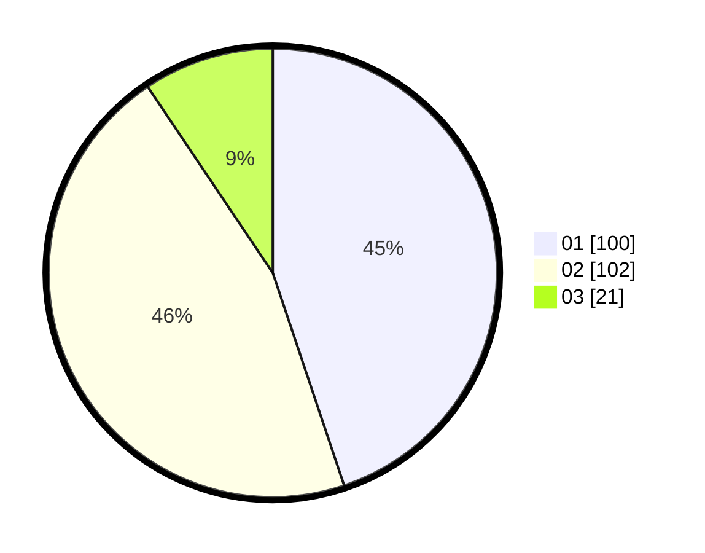

# Hasil

Hasil perolehan suara paslon dapat dilihat pada file paslon-01.txt, paslon-02.txt, dan paslon-03.txt.

Jika tidak ada, artinya data tersebut belum ada pada SIREKAP.

## Perolehan Suara

 * Paslon 01: **100**.
 * Paslon 02: **102**.
 * Paslon 03: **21**.

## Foto C Plano

https://sirekap-obj-formc.kpu.go.id/546a/pemilu/ppwp/31/75/09/10/05/3175091005101-20240216-071119--1ecca4af-5dd5-44a1-9574-3e6c652c035f.jpg

https://sirekap-obj-formc.kpu.go.id/546a/pemilu/ppwp/31/75/09/10/05/3175091005101-20240216-071121--c971c40f-3b51-4e87-bfc8-a98e4c8b5201.jpg

https://sirekap-obj-formc.kpu.go.id/546a/pemilu/ppwp/31/75/09/10/05/3175091005101-20240216-071120--e7962526-cd99-4ef8-bef2-d4c0ac3609af.jpg

## DATA PEMILIH TETAP

Jumlah pemilih dalam DPT: **268**.
 * L: **132**.
 * P: **136**.

## DATA PENGGUNA HAK PILIH

Jumlah pengguna hak pilih dalam DPT: **223**.
 * L: **107**.
 * P: **116**.

Jumlah pengguna hak pilih dalam DPTb: **0**.
 * L: **0**.
 * P: **0**.

Jumlah pengguna hak pilih dalam DPK: **4**.
 * L: **2**.
 * P: **2**.

Jumlah pengguna hak pilih: **227**.
 * L: **109**.
 * P: **118**.

## JUMLAH SUARA SAH DAN TIDAK SAH

JUMLAH SELURUH SUARA SAH: **223**.

JUMLAH SUARA TIDAK SAH: **4**.

JUMLAH SELURUH SUARA SAH DAN SUARA TIDAK SAH: **227**.
