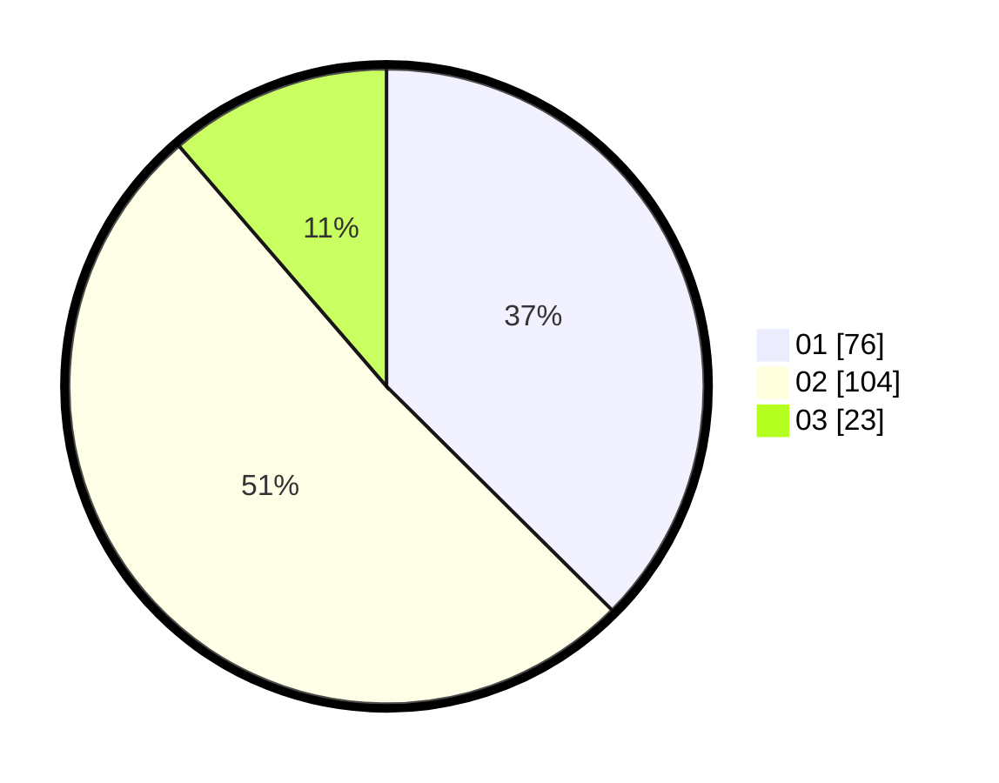

# Hasil

Hasil perolehan suara paslon dapat dilihat pada file paslon-01.txt, paslon-02.txt, dan paslon-03.txt.

Jika tidak ada, artinya data tersebut belum ada pada SIREKAP.

## Perolehan Suara

 * Paslon 01: **76**.
 * Paslon 02: **104**.
 * Paslon 03: **23**.

## Foto C Plano

https://sirekap-obj-formc.kpu.go.id/4ee6/pemilu/ppwp/31/75/09/10/05/3175091005120-20240214-190446--aadf8e86-950c-42c0-8262-4797520dd228.jpg

https://sirekap-obj-formc.kpu.go.id/4ee6/pemilu/ppwp/31/75/09/10/05/3175091005120-20240214-190452--8e46a80c-7a72-41ef-a713-0b4e499b7656.jpg

https://sirekap-obj-formc.kpu.go.id/4ee6/pemilu/ppwp/31/75/09/10/05/3175091005120-20240214-215318--7a1fb510-61f6-47db-9036-f5b60dedc60e.jpg
