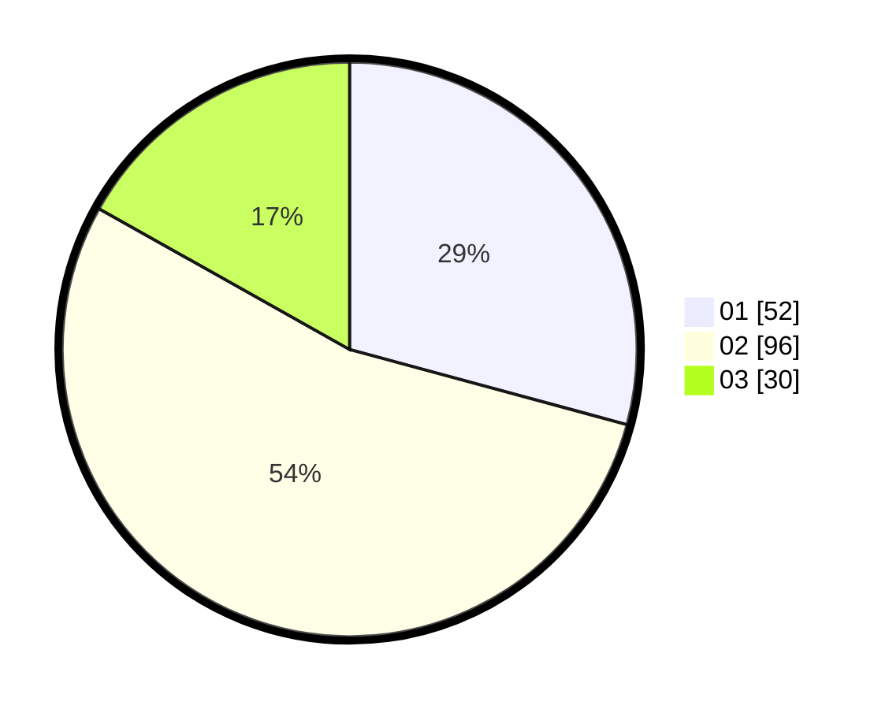

# Hasil

Hasil perolehan suara paslon dapat dilihat pada file paslon-01.txt, paslon-02.txt, dan paslon-03.txt.

Jika tidak ada, artinya data tersebut belum ada pada SIREKAP.

## Perolehan Suara

 * Paslon 01: **52**.
 * Paslon 02: **96**.
 * Paslon 03: **30**.

## Foto C Plano

https://sirekap-obj-formc.kpu.go.id/48a7/pemilu/ppwp/31/75/09/10/05/3175091005124-20240216-152059--37601fae-2dcf-4f1b-afde-3b9422e17bde.jpg

https://sirekap-obj-formc.kpu.go.id/48a7/pemilu/ppwp/31/75/09/10/05/3175091005124-20240216-152100--bbdd0a96-e93e-4ec4-9ec3-e473f969c40d.jpg

https://sirekap-obj-formc.kpu.go.id/48a7/pemilu/ppwp/31/75/09/10/05/3175091005124-20240216-152100--c85737d4-b50a-41d0-821a-46615262ff22.jpg

## DATA PEMILIH TETAP

Jumlah pemilih dalam DPT: **242**.
 * L: **126**.
 * P: **116**.

## DATA PENGGUNA HAK PILIH

Jumlah pengguna hak pilih dalam DPT: **175**.
 * L: **85**.
 * P: **90**.

Jumlah pengguna hak pilih dalam DPTb: **0**.
 * L: **0**.
 * P: **0**.

Jumlah pengguna hak pilih dalam DPK: **5**.
 * L: **2**.
 * P: **3**.

Jumlah pengguna hak pilih: **180**.
 * L: **87**.
 * P: **93**.

## JUMLAH SUARA SAH DAN TIDAK SAH

JUMLAH SELURUH SUARA SAH: **178**.

JUMLAH SUARA TIDAK SAH: **2**.

JUMLAH SELURUH SUARA SAH DAN SUARA TIDAK SAH: **180**.
