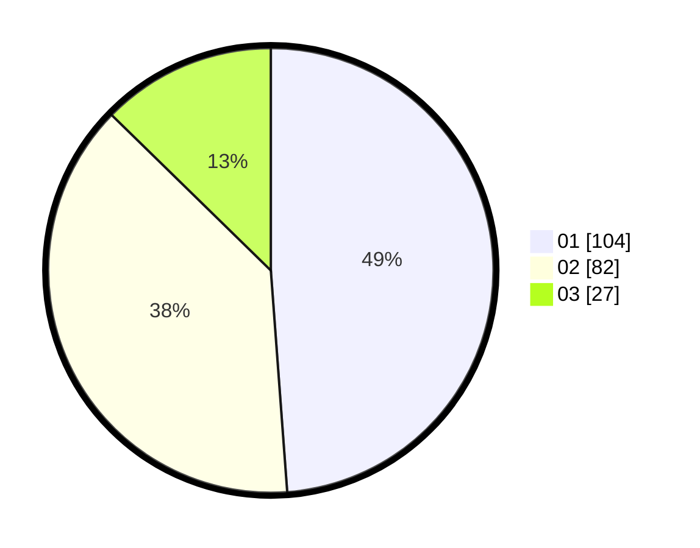

# Hasil

Hasil perolehan suara paslon dapat dilihat pada file paslon-01.txt, paslon-02.txt, dan paslon-03.txt.

Jika tidak ada, artinya data tersebut belum ada pada SIREKAP.

## Perolehan Suara

 * Paslon 01: **104**.
 * Paslon 02: **82**.
 * Paslon 03: **27**.

## Foto C Plano

https://sirekap-obj-formc.kpu.go.id/61df/pemilu/ppwp/31/75/10/10/01/3175101001009-20240214-222028--0b28746d-9e93-4448-978d-a2bac1f7ee7b.jpg

https://sirekap-obj-formc.kpu.go.id/61df/pemilu/ppwp/31/75/10/10/01/3175101001009-20240214-221552--714f4c24-cfb5-416b-b9c7-b77d2eb633e0.jpg

https://sirekap-obj-formc.kpu.go.id/61df/pemilu/ppwp/31/75/10/10/01/3175101001009-20240214-221944--3d5bf3c0-6a57-4c6e-b5de-4ec2e7c2a145.jpg

## DATA PEMILIH TETAP

Jumlah pemilih dalam DPT: **243**.
 * L: **124**.
 * P: **119**.

## DATA PENGGUNA HAK PILIH

Jumlah pengguna hak pilih dalam DPT: **208**.
 * L: **104**.
 * P: **104**.

Jumlah pengguna hak pilih dalam DPTb: **8**.
 * L: **0**.
 * P: **8**.

Jumlah pengguna hak pilih dalam DPK: **2**.
 * L: **0**.
 * P: **2**.

Jumlah pengguna hak pilih: **218**.
 * L: **104**.
 * P: **114**.

## JUMLAH SUARA SAH DAN TIDAK SAH

JUMLAH SELURUH SUARA SAH: **213**.

JUMLAH SUARA TIDAK SAH: **5**.

JUMLAH SELURUH SUARA SAH DAN SUARA TIDAK SAH: **218**.
