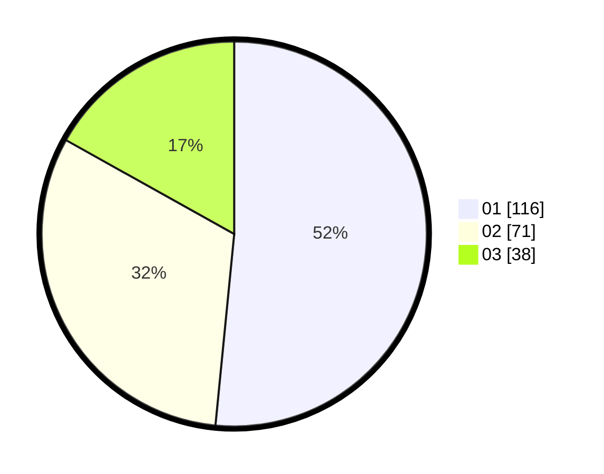

# Hasil

Hasil perolehan suara paslon dapat dilihat pada file paslon-01.txt, paslon-02.txt, dan paslon-03.txt.

Jika tidak ada, artinya data tersebut belum ada pada SIREKAP.

## Perolehan Suara

 * Paslon 01: **116**.
 * Paslon 02: **71**.
 * Paslon 03: **38**.

## Foto C Plano

https://sirekap-obj-formc.kpu.go.id/55e5/pemilu/ppwp/31/75/10/10/01/3175101001015-20240215-011614--cb21ad47-c3fc-42a5-a21f-b36b5da78ede.jpg

https://sirekap-obj-formc.kpu.go.id/55e5/pemilu/ppwp/31/75/10/10/01/3175101001015-20240215-011806--987a2c74-a2e9-408a-90b3-f07a47fba327.jpg

https://sirekap-obj-formc.kpu.go.id/55e5/pemilu/ppwp/31/75/10/10/01/3175101001015-20240215-011926--a79f9598-57d2-4976-95a7-858313763309.jpg
