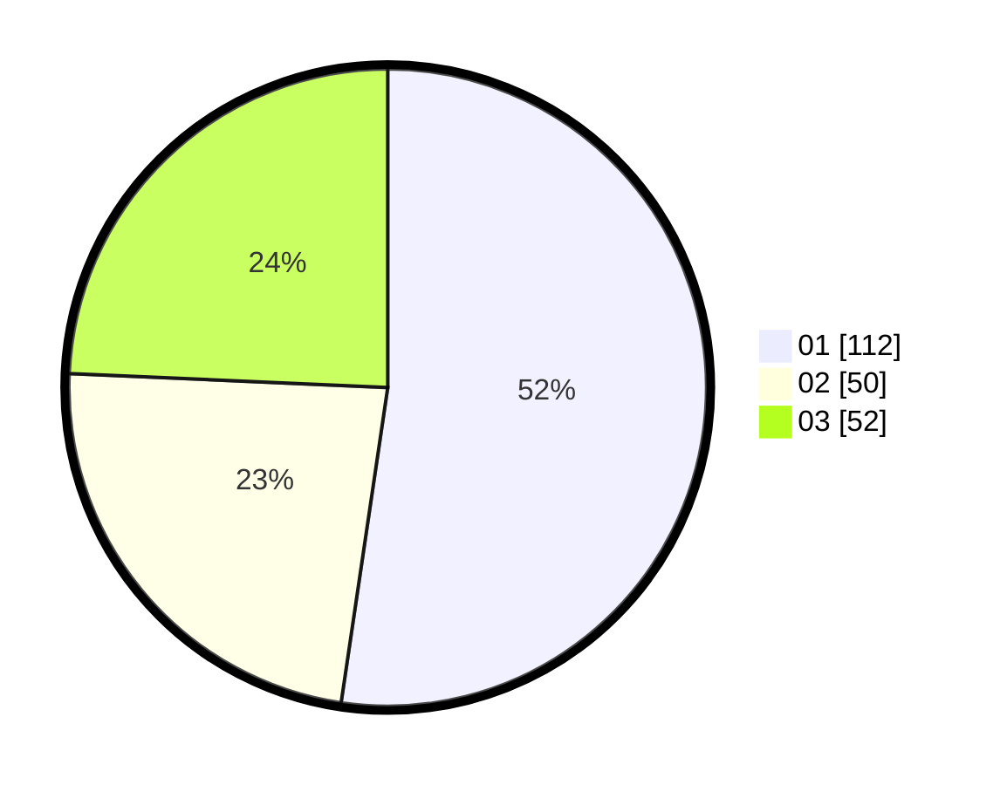

# Hasil

Hasil perolehan suara paslon dapat dilihat pada file paslon-01.txt, paslon-02.txt, dan paslon-03.txt.

Jika tidak ada, artinya data tersebut belum ada pada SIREKAP.

## Perolehan Suara

 * Paslon 01: **112**.
 * Paslon 02: **50**.
 * Paslon 03: **52**.

## Foto C Plano

https://sirekap-obj-formc.kpu.go.id/fe8e/pemilu/ppwp/31/75/10/10/01/3175101001016-20240214-155826--4c3ca1fc-a87d-45f5-bd0b-b7e367e537db.jpg

https://sirekap-obj-formc.kpu.go.id/fe8e/pemilu/ppwp/31/75/10/10/01/3175101001016-20240214-155326--b2086cc8-f252-4def-b030-de87e8be4876.jpg

https://sirekap-obj-formc.kpu.go.id/fe8e/pemilu/ppwp/31/75/10/10/01/3175101001016-20240214-155151--e3e6db6e-dd16-4488-a3e6-8d2958a6f8ea.jpg

## DATA PEMILIH TETAP

Jumlah pemilih dalam DPT: **268**.
 * L: **132**.
 * P: **136**.

## DATA PENGGUNA HAK PILIH

Jumlah pengguna hak pilih dalam DPT: **215**.
 * L: **100**.
 * P: **115**.

Jumlah pengguna hak pilih dalam DPTb: **2**.
 * L: **2**.
 * P: **0**.

Jumlah pengguna hak pilih dalam DPK: **0**.
 * L: **0**.
 * P: **0**.

Jumlah pengguna hak pilih: **217**.
 * L: **102**.
 * P: **115**.

## JUMLAH SUARA SAH DAN TIDAK SAH

JUMLAH SELURUH SUARA SAH: **214**.

JUMLAH SUARA TIDAK SAH: **3**.

JUMLAH SELURUH SUARA SAH DAN SUARA TIDAK SAH: **217**.
