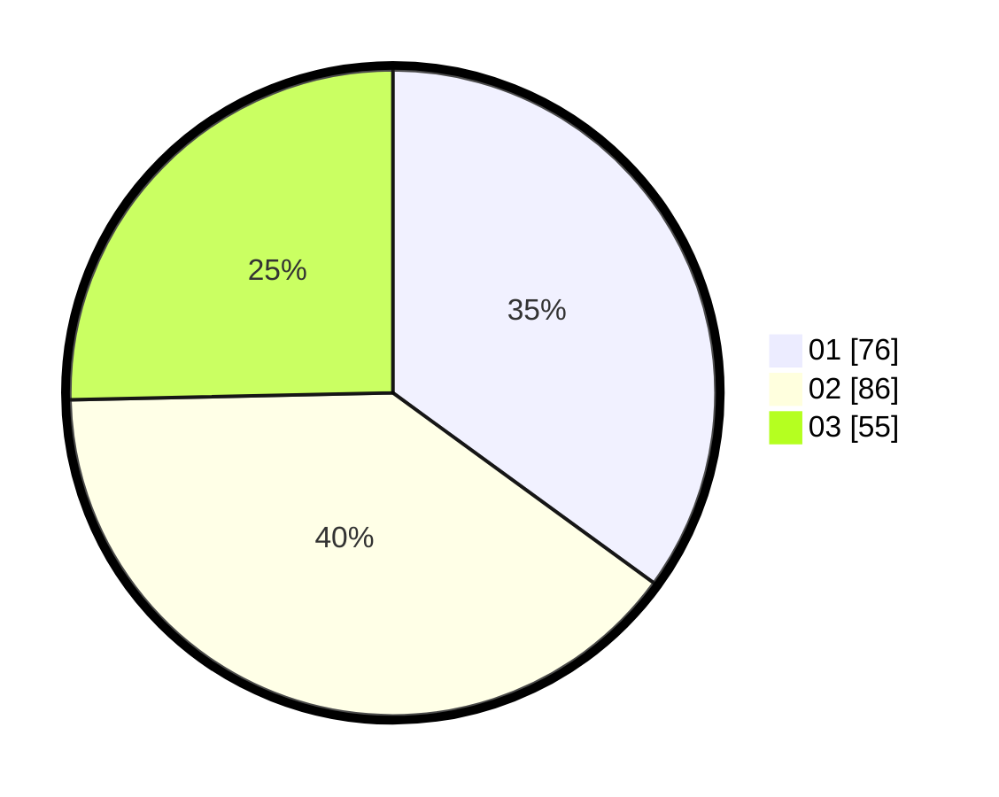

# Hasil

Hasil perolehan suara paslon dapat dilihat pada file paslon-01.txt, paslon-02.txt, dan paslon-03.txt.

Jika tidak ada, artinya data tersebut belum ada pada SIREKAP.

## Perolehan Suara

 * Paslon 01: **76**.
 * Paslon 02: **86**.
 * Paslon 03: **55**.

## Foto C Plano

https://sirekap-obj-formc.kpu.go.id/9796/pemilu/ppwp/31/75/10/10/01/3175101001017-20240214-223555--9996bc55-44e9-4c53-831d-4f1d7d57f076.jpg

https://sirekap-obj-formc.kpu.go.id/9796/pemilu/ppwp/31/75/10/10/01/3175101001017-20240214-223814--b30c178c-3396-4fa5-a018-2fb1955b1e6a.jpg

https://sirekap-obj-formc.kpu.go.id/9796/pemilu/ppwp/31/75/10/10/01/3175101001017-20240214-223925--755f55bd-9e11-4e98-9fe0-a2c70d47f34d.jpg
