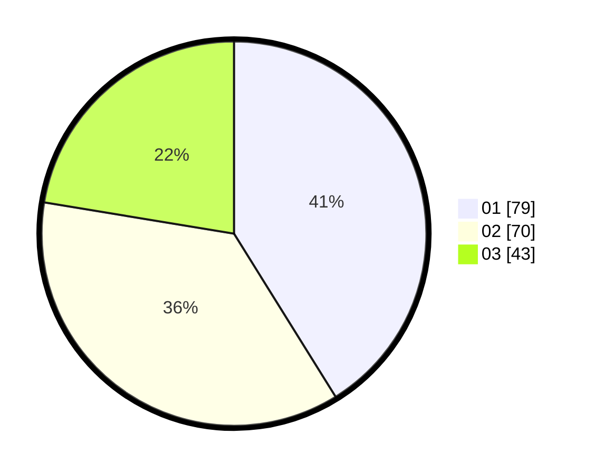

# Hasil

Hasil perolehan suara paslon dapat dilihat pada file paslon-01.txt, paslon-02.txt, dan paslon-03.txt.

Jika tidak ada, artinya data tersebut belum ada pada SIREKAP.

## Perolehan Suara

 * Paslon 01: **79**.
 * Paslon 02: **70**.
 * Paslon 03: **43**.

## Foto C Plano

https://sirekap-obj-formc.kpu.go.id/740d/pemilu/ppwp/31/75/10/10/01/3175101001018-20240214-205846--0277862b-b25c-4e9a-8aea-68a476049f54.jpg

https://sirekap-obj-formc.kpu.go.id/740d/pemilu/ppwp/31/75/10/10/01/3175101001018-20240214-220512--3e535601-4331-48d9-8248-d80a4144230e.jpg

https://sirekap-obj-formc.kpu.go.id/740d/pemilu/ppwp/31/75/10/10/01/3175101001018-20240214-220706--5ff68b86-085b-4cdb-8af2-336e7f911625.jpg

## DATA PEMILIH TETAP

Jumlah pemilih dalam DPT: **231**.
 * L: **117**.
 * P: **114**.

## DATA PENGGUNA HAK PILIH

Jumlah pengguna hak pilih dalam DPT: **191**.
 * L: **92**.
 * P: **99**.

Jumlah pengguna hak pilih dalam DPTb: **0**.
 * L: **0**.
 * P: **0**.

Jumlah pengguna hak pilih dalam DPK: **4**.
 * L: **1**.
 * P: **3**.

Jumlah pengguna hak pilih: **195**.
 * L: **93**.
 * P: **102**.

## JUMLAH SUARA SAH DAN TIDAK SAH

JUMLAH SELURUH SUARA SAH: **192**.

JUMLAH SUARA TIDAK SAH: **3**.

JUMLAH SELURUH SUARA SAH DAN SUARA TIDAK SAH: **195**.
