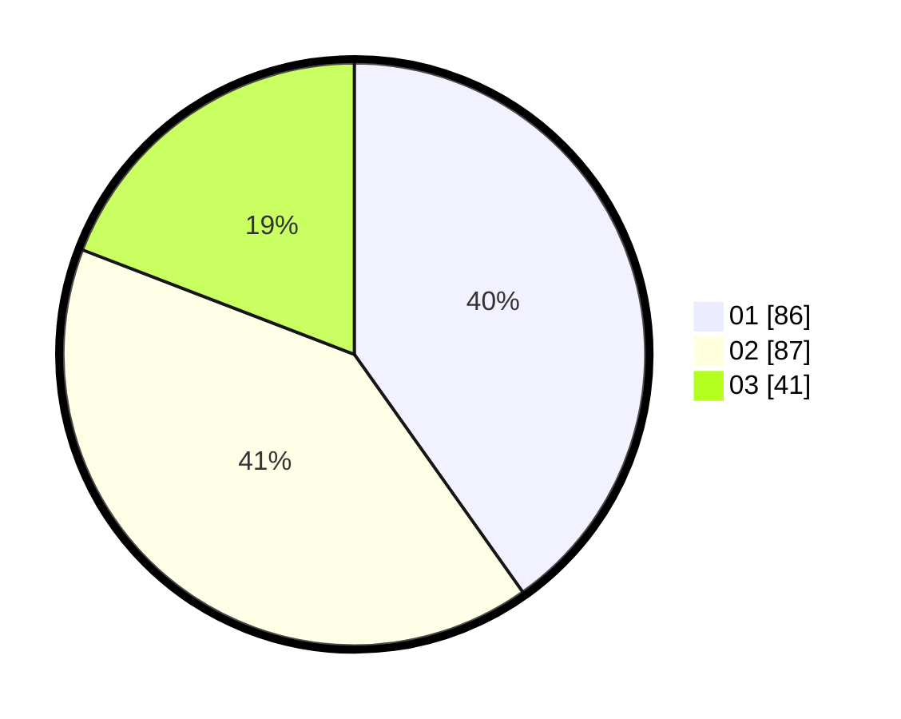

# Hasil

Hasil perolehan suara paslon dapat dilihat pada file paslon-01.txt, paslon-02.txt, dan paslon-03.txt.

Jika tidak ada, artinya data tersebut belum ada pada SIREKAP.

## Perolehan Suara

 * Paslon 01: **86**.
 * Paslon 02: **87**.
 * Paslon 03: **41**.

## Foto C Plano

https://sirekap-obj-formc.kpu.go.id/572b/pemilu/ppwp/31/75/10/10/01/3175101001021-20240216-092024--5d5abcff-5579-4f57-a36f-631f3b7103cb.jpg

https://sirekap-obj-formc.kpu.go.id/572b/pemilu/ppwp/31/75/10/10/01/3175101001021-20240216-092056--ee32adaf-2272-4981-ada9-27acc452fac6.jpg

https://sirekap-obj-formc.kpu.go.id/572b/pemilu/ppwp/31/75/10/10/01/3175101001021-20240216-092125--47cb0ca8-209a-47e1-8920-46f4fcb8aa57.jpg

## DATA PEMILIH TETAP

Jumlah pemilih dalam DPT: **257**.
 * L: **125**.
 * P: **132**.

## DATA PENGGUNA HAK PILIH

Jumlah pengguna hak pilih dalam DPT: **209**.
 * L: **103**.
 * P: **106**.

Jumlah pengguna hak pilih dalam DPTb: **3**.
 * L: **1**.
 * P: **2**.

Jumlah pengguna hak pilih dalam DPK: **3**.
 * L: **2**.
 * P: **1**.

Jumlah pengguna hak pilih: **215**.
 * L: **106**.
 * P: **109**.

## JUMLAH SUARA SAH DAN TIDAK SAH

JUMLAH SELURUH SUARA SAH: **214**.

JUMLAH SUARA TIDAK SAH: **1**.

JUMLAH SELURUH SUARA SAH DAN SUARA TIDAK SAH: **215**.
