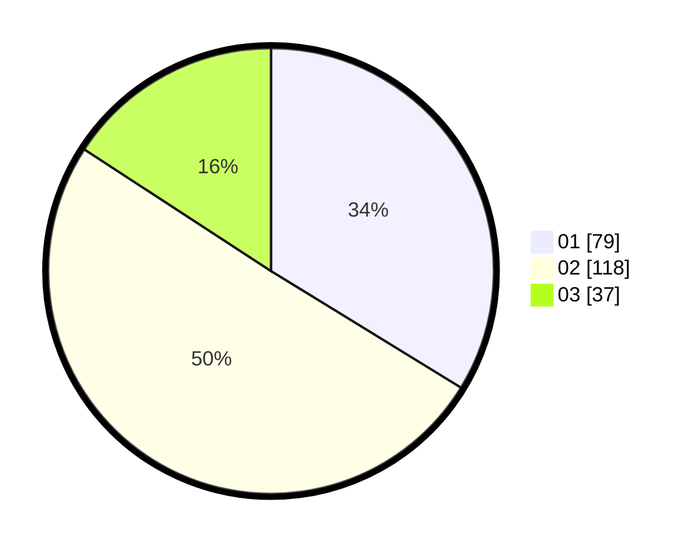

# Hasil

Hasil perolehan suara paslon dapat dilihat pada file paslon-01.txt, paslon-02.txt, dan paslon-03.txt.

Jika tidak ada, artinya data tersebut belum ada pada SIREKAP.

## Perolehan Suara

 * Paslon 01: **79**.
 * Paslon 02: **118**.
 * Paslon 03: **37**.

## Foto C Plano

https://sirekap-obj-formc.kpu.go.id/c1c2/pemilu/ppwp/31/75/10/10/01/3175101001025-20240214-215326--c7130ded-4935-4c6b-9b11-16646ba8fc4d.jpg

https://sirekap-obj-formc.kpu.go.id/c1c2/pemilu/ppwp/31/75/10/10/01/3175101001025-20240214-215330--6a263a8a-c6d4-4283-8421-939278b9739f.jpg

https://sirekap-obj-formc.kpu.go.id/c1c2/pemilu/ppwp/31/75/10/10/01/3175101001025-20240214-215336--1835f59a-6388-4a5f-8a0f-4df8a5cb1ee0.jpg
