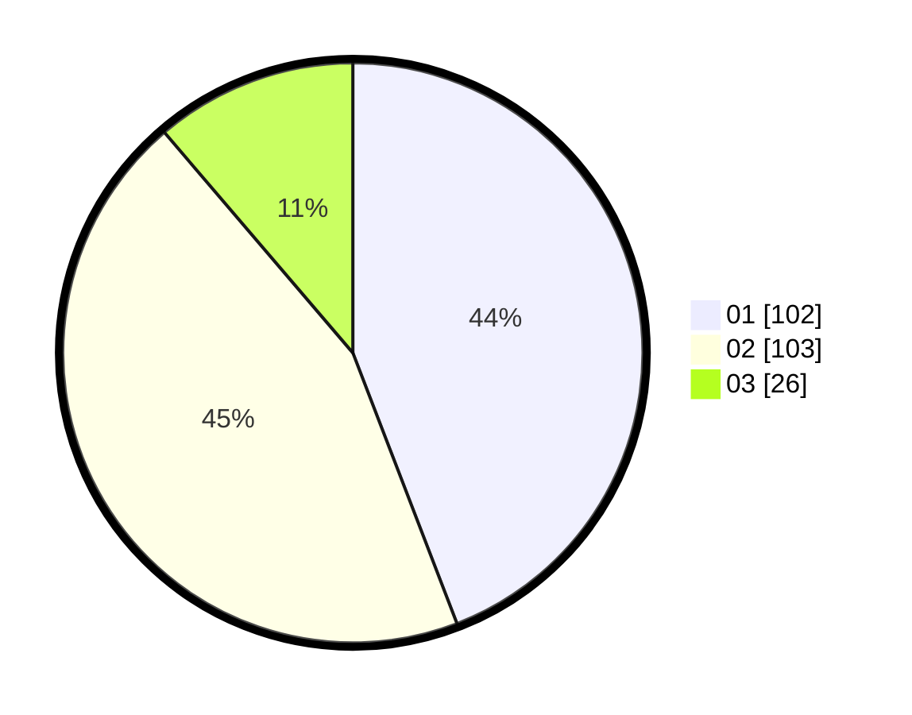

# Hasil

Hasil perolehan suara paslon dapat dilihat pada file paslon-01.txt, paslon-02.txt, dan paslon-03.txt.

Jika tidak ada, artinya data tersebut belum ada pada SIREKAP.

## Perolehan Suara

 * Paslon 01: **102**.
 * Paslon 02: **103**.
 * Paslon 03: **26**.

## Foto C Plano

https://sirekap-obj-formc.kpu.go.id/d227/pemilu/ppwp/31/75/10/10/01/3175101001026-20240214-203538--d1c90784-f936-498f-b5fe-d54016199f40.jpg

https://sirekap-obj-formc.kpu.go.id/d227/pemilu/ppwp/31/75/10/10/01/3175101001026-20240214-190459--38b67e98-b1c2-47aa-ad5a-e5a1001a5293.jpg
