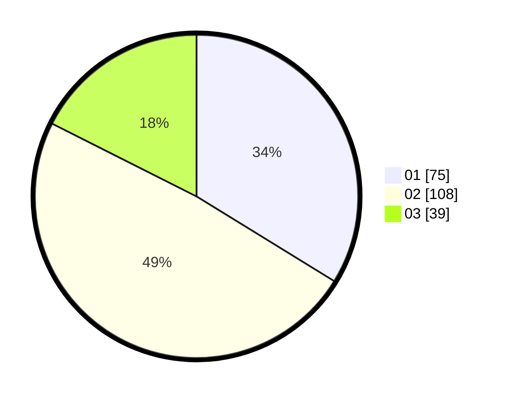

# Hasil

Hasil perolehan suara paslon dapat dilihat pada file paslon-01.txt, paslon-02.txt, dan paslon-03.txt.

Jika tidak ada, artinya data tersebut belum ada pada SIREKAP.

## Perolehan Suara

 * Paslon 01: **75**.
 * Paslon 02: **108**.
 * Paslon 03: **39**.

## Foto C Plano

https://sirekap-obj-formc.kpu.go.id/f0da/pemilu/ppwp/31/75/10/10/01/3175101001030-20240216-142544--0f8be4d1-72fe-4c1e-82e9-796a371f11d1.jpg

https://sirekap-obj-formc.kpu.go.id/f0da/pemilu/ppwp/31/75/10/10/01/3175101001030-20240216-142546--21c85c69-22d3-4225-989b-d1e7a0068fd1.jpg

https://sirekap-obj-formc.kpu.go.id/f0da/pemilu/ppwp/31/75/10/10/01/3175101001030-20240216-142545--0196da59-269d-4a45-b273-99ac50aef384.jpg

## DATA PEMILIH TETAP

Jumlah pemilih dalam DPT: **268**.
 * L: **133**.
 * P: **135**.

## DATA PENGGUNA HAK PILIH

Jumlah pengguna hak pilih dalam DPT: **221**.
 * L: **107**.
 * P: **114**.

Jumlah pengguna hak pilih dalam DPTb: **2**.
 * L: **0**.
 * P: **2**.

Jumlah pengguna hak pilih dalam DPK: **0**.
 * L: **0**.
 * P: **0**.

Jumlah pengguna hak pilih: **223**.
 * L: **107**.
 * P: **116**.

## JUMLAH SUARA SAH DAN TIDAK SAH

JUMLAH SELURUH SUARA SAH: **222**.

JUMLAH SUARA TIDAK SAH: **1**.

JUMLAH SELURUH SUARA SAH DAN SUARA TIDAK SAH: **223**.
