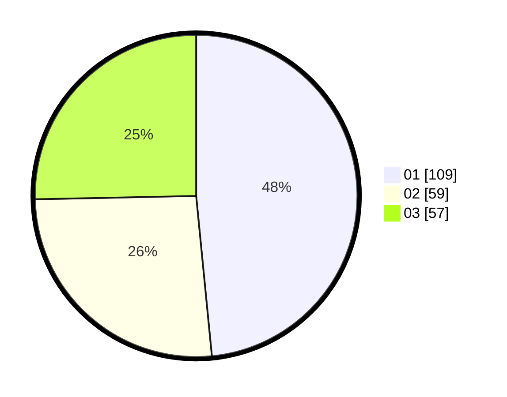

# Hasil

Hasil perolehan suara paslon dapat dilihat pada file paslon-01.txt, paslon-02.txt, dan paslon-03.txt.

Jika tidak ada, artinya data tersebut belum ada pada SIREKAP.

## Perolehan Suara

 * Paslon 01: **109**.
 * Paslon 02: **59**.
 * Paslon 03: **57**.

## Foto C Plano

https://sirekap-obj-formc.kpu.go.id/0097/pemilu/ppwp/31/75/10/10/01/3175101001032-20240214-185152--94f9456e-00ad-400f-aab2-c07d28425a2d.jpg

https://sirekap-obj-formc.kpu.go.id/0097/pemilu/ppwp/31/75/10/10/01/3175101001032-20240214-185204--f37c9bb3-5911-4d30-aa10-3b0821be14cd.jpg

https://sirekap-obj-formc.kpu.go.id/0097/pemilu/ppwp/31/75/10/10/01/3175101001032-20240215-211209--0ab3bdcd-d235-4e05-92c9-8b4cc724dcff.jpg

## DATA PEMILIH TETAP

Jumlah pemilih dalam DPT: **239**.
 * L: **134**.
 * P: **115**.

## DATA PENGGUNA HAK PILIH

Jumlah pengguna hak pilih dalam DPT: **209**.
 * L: **109**.
 * P: **100**.

Jumlah pengguna hak pilih dalam DPTb: **17**.
 * L: **2**.
 * P: **15**.

Jumlah pengguna hak pilih dalam DPK: **3**.
 * L: **0**.
 * P: **3**.

Jumlah pengguna hak pilih: **229**.
 * L: **111**.
 * P: **118**.

## JUMLAH SUARA SAH DAN TIDAK SAH

JUMLAH SELURUH SUARA SAH: **225**.

JUMLAH SUARA TIDAK SAH: **4**.

JUMLAH SELURUH SUARA SAH DAN SUARA TIDAK SAH: **229**.
