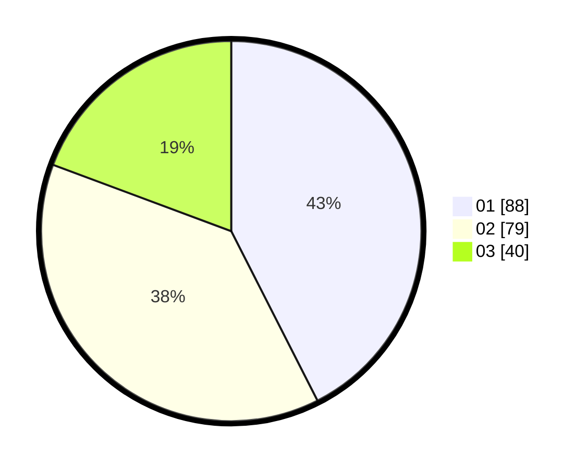

# Hasil

Hasil perolehan suara paslon dapat dilihat pada file paslon-01.txt, paslon-02.txt, dan paslon-03.txt.

Jika tidak ada, artinya data tersebut belum ada pada SIREKAP.

## Perolehan Suara

 * Paslon 01: **88**.
 * Paslon 02: **79**.
 * Paslon 03: **40**.

## Foto C Plano

https://sirekap-obj-formc.kpu.go.id/1634/pemilu/ppwp/31/75/10/10/01/3175101001035-20240214-191042--e69d5f5b-3f4b-4976-a8f7-dc765bad1670.jpg

https://sirekap-obj-formc.kpu.go.id/1634/pemilu/ppwp/31/75/10/10/01/3175101001035-20240214-191819--9fbc2367-2e1a-48c9-a606-64e1c21542fc.jpg

https://sirekap-obj-formc.kpu.go.id/1634/pemilu/ppwp/31/75/10/10/01/3175101001035-20240214-155841--a80e4068-203b-4131-b962-a46b3b8028d9.jpg

## DATA PEMILIH TETAP

Jumlah pemilih dalam DPT: **276**.
 * L: **142**.
 * P: **134**.

## DATA PENGGUNA HAK PILIH

Jumlah pengguna hak pilih dalam DPT: **207**.
 * L: **104**.
 * P: **103**.

Jumlah pengguna hak pilih dalam DPTb: **1**.
 * L: **0**.
 * P: **1**.

Jumlah pengguna hak pilih dalam DPK: **1**.
 * L: **0**.
 * P: **1**.

Jumlah pengguna hak pilih: **209**.
 * L: **104**.
 * P: **105**.

## JUMLAH SUARA SAH DAN TIDAK SAH

JUMLAH SELURUH SUARA SAH: **207**.

JUMLAH SUARA TIDAK SAH: **2**.

JUMLAH SELURUH SUARA SAH DAN SUARA TIDAK SAH: **209**.
