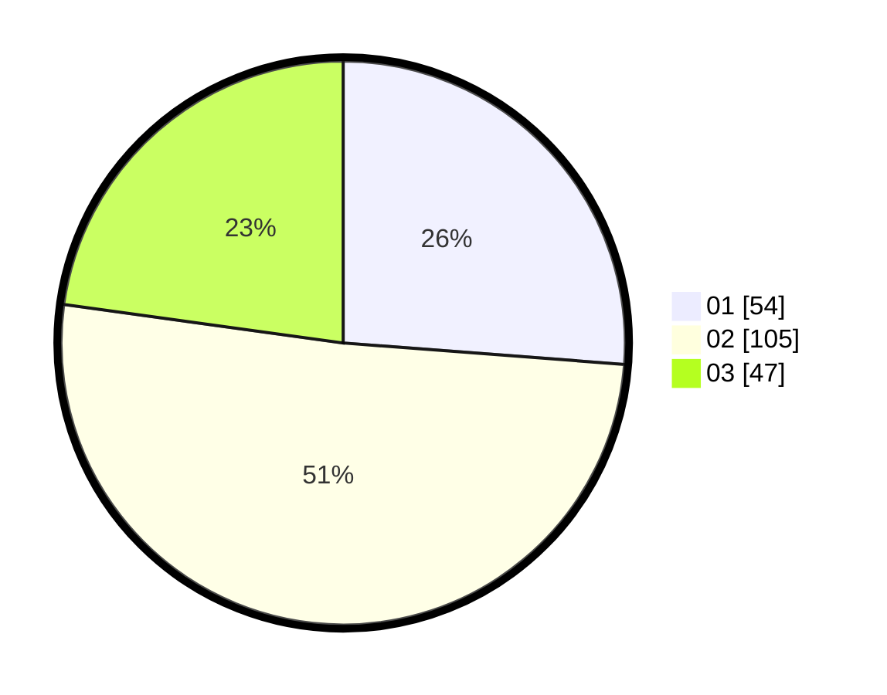

# Hasil

Hasil perolehan suara paslon dapat dilihat pada file paslon-01.txt, paslon-02.txt, dan paslon-03.txt.

Jika tidak ada, artinya data tersebut belum ada pada SIREKAP.

## Perolehan Suara

 * Paslon 01: **54**.
 * Paslon 02: **105**.
 * Paslon 03: **47**.

## Foto C Plano

https://sirekap-obj-formc.kpu.go.id/5709/pemilu/ppwp/31/75/10/10/01/3175101001045-20240214-233940--def88837-b573-4f79-bf64-3d5ac7b1cce5.jpg

https://sirekap-obj-formc.kpu.go.id/5709/pemilu/ppwp/31/75/10/10/01/3175101001045-20240214-234454--673903c2-d3d6-4cc0-9e2b-bb695a31d03c.jpg

https://sirekap-obj-formc.kpu.go.id/5709/pemilu/ppwp/31/75/10/10/01/3175101001045-20240214-234554--ab78507b-df46-456a-ad0e-649fce61c371.jpg

## DATA PEMILIH TETAP

Jumlah pemilih dalam DPT: **279**.
 * L: **138**.
 * P: **141**.

## DATA PENGGUNA HAK PILIH

Jumlah pengguna hak pilih dalam DPT: **200**.
 * L: **99**.
 * P: **101**.

Jumlah pengguna hak pilih dalam DPTb: **6**.
 * L: **2**.
 * P: **4**.

Jumlah pengguna hak pilih dalam DPK: **2**.
 * L: **2**.
 * P: **0**.

Jumlah pengguna hak pilih: **208**.
 * L: **103**.
 * P: **105**.

## JUMLAH SUARA SAH DAN TIDAK SAH

JUMLAH SELURUH SUARA SAH: **206**.

JUMLAH SUARA TIDAK SAH: **2**.

JUMLAH SELURUH SUARA SAH DAN SUARA TIDAK SAH: **208**.
