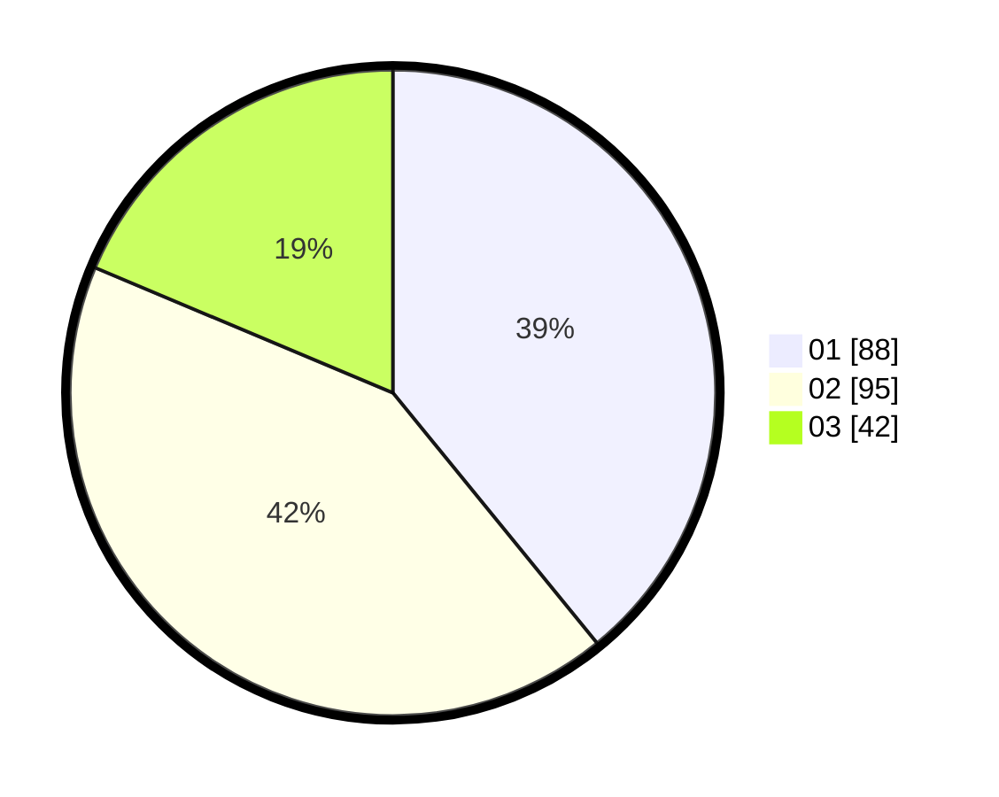

# Hasil

Hasil perolehan suara paslon dapat dilihat pada file paslon-01.txt, paslon-02.txt, dan paslon-03.txt.

Jika tidak ada, artinya data tersebut belum ada pada SIREKAP.

## Perolehan Suara

 * Paslon 01: **88**.
 * Paslon 02: **95**.
 * Paslon 03: **42**.

## Foto C Plano

https://sirekap-obj-formc.kpu.go.id/7fb8/pemilu/ppwp/31/75/10/10/01/3175101001050-20240215-174356--badbde22-ce47-4f43-9cc8-b18d1a7800aa.jpg

https://sirekap-obj-formc.kpu.go.id/7fb8/pemilu/ppwp/31/75/10/10/01/3175101001050-20240215-174359--adeef38a-e37d-4d70-b337-dbe7f8d2b15f.jpg

https://sirekap-obj-formc.kpu.go.id/7fb8/pemilu/ppwp/31/75/10/10/01/3175101001050-20240215-174401--c5333582-b7d5-4fa1-beda-cdb4f431cf98.jpg

## DATA PEMILIH TETAP

Jumlah pemilih dalam DPT: **289**.
 * L: **148**.
 * P: **141**.

## DATA PENGGUNA HAK PILIH

Jumlah pengguna hak pilih dalam DPT: **230**.
 * L: **110**.
 * P: **120**.

Jumlah pengguna hak pilih dalam DPTb: **0**.
 * L: **0**.
 * P: **0**.

Jumlah pengguna hak pilih dalam DPK: **3**.
 * L: **1**.
 * P: **2**.

Jumlah pengguna hak pilih: **233**.
 * L: **111**.
 * P: **122**.

## JUMLAH SUARA SAH DAN TIDAK SAH

JUMLAH SELURUH SUARA SAH: **226**.

JUMLAH SUARA TIDAK SAH: **7**.

JUMLAH SELURUH SUARA SAH DAN SUARA TIDAK SAH: **233**.
