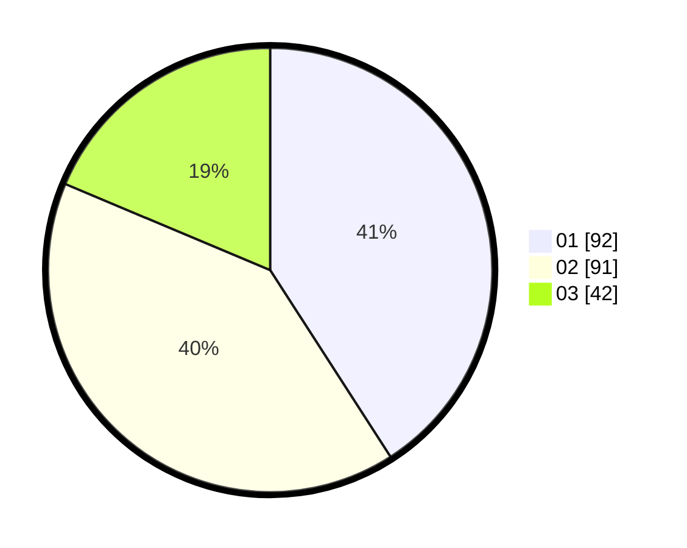

# Hasil

Hasil perolehan suara paslon dapat dilihat pada file paslon-01.txt, paslon-02.txt, dan paslon-03.txt.

Jika tidak ada, artinya data tersebut belum ada pada SIREKAP.

## Perolehan Suara

 * Paslon 01: **92**.
 * Paslon 02: **91**.
 * Paslon 03: **42**.

## Foto C Plano

https://sirekap-obj-formc.kpu.go.id/3e85/pemilu/ppwp/31/75/10/10/01/3175101001066-20240215-205647--aff61672-fdbc-4275-8d25-14c03b985946.jpg

https://sirekap-obj-formc.kpu.go.id/3e85/pemilu/ppwp/31/75/10/10/01/3175101001066-20240215-205649--cbdfc4d7-bd2c-4b6f-9724-7041dd104a82.jpg

https://sirekap-obj-formc.kpu.go.id/3e85/pemilu/ppwp/31/75/10/10/01/3175101001066-20240215-205648--5cc67879-8025-4ae1-9382-49640ecebe75.jpg

## DATA PEMILIH TETAP

Jumlah pemilih dalam DPT: **286**.
 * L: **139**.
 * P: **147**.

## DATA PENGGUNA HAK PILIH

Jumlah pengguna hak pilih dalam DPT: **222**.
 * L: **102**.
 * P: **120**.

Jumlah pengguna hak pilih dalam DPTb: **4**.
 * L: **1**.
 * P: **3**.

Jumlah pengguna hak pilih dalam DPK: **4**.
 * L: **3**.
 * P: **1**.

Jumlah pengguna hak pilih: **230**.
 * L: **106**.
 * P: **124**.

## JUMLAH SUARA SAH DAN TIDAK SAH

JUMLAH SELURUH SUARA SAH: **225**.

JUMLAH SUARA TIDAK SAH: **5**.

JUMLAH SELURUH SUARA SAH DAN SUARA TIDAK SAH: **230**.
