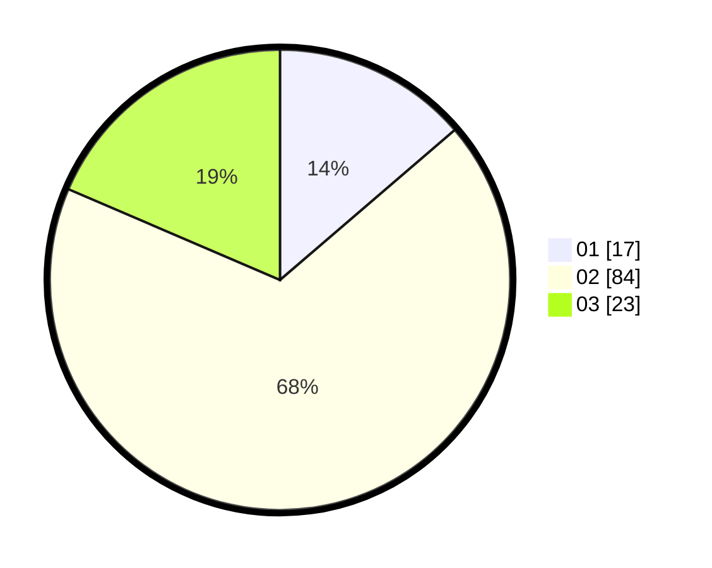

# Hasil

Hasil perolehan suara paslon dapat dilihat pada file paslon-01.txt, paslon-02.txt, dan paslon-03.txt.

Jika tidak ada, artinya data tersebut belum ada pada SIREKAP.

## Perolehan Suara

 * Paslon 01: **17**.
 * Paslon 02: **84**.
 * Paslon 03: **23**.

## Foto C Plano

https://sirekap-obj-formc.kpu.go.id/2900/pemilu/ppwp/31/75/10/10/01/3175101001073-20240214-185526--24f3d0d4-27cc-4937-a927-f3ce9efb8dcb.jpg

https://sirekap-obj-formc.kpu.go.id/2900/pemilu/ppwp/31/75/10/10/01/3175101001073-20240214-185644--98bed9d4-30e6-4802-889a-e97ff7ec2e08.jpg

https://sirekap-obj-formc.kpu.go.id/2900/pemilu/ppwp/31/75/10/10/01/3175101001073-20240214-185625--185cbd20-69bf-465f-9a68-c1bb84564357.jpg

## DATA PEMILIH TETAP

Jumlah pemilih dalam DPT: **280**.
 * L: **280**.
 * P: **0**.

## DATA PENGGUNA HAK PILIH

Jumlah pengguna hak pilih dalam DPT: **141**.
 * L: **141**.
 * P: **0**.

Jumlah pengguna hak pilih dalam DPTb: **5**.
 * L: **3**.
 * P: **2**.

Jumlah pengguna hak pilih dalam DPK: **1**.
 * L: **1**.
 * P: **0**.

Jumlah pengguna hak pilih: **147**.
 * L: **145**.
 * P: **2**.

## JUMLAH SUARA SAH DAN TIDAK SAH

JUMLAH SELURUH SUARA SAH: **124**.

JUMLAH SUARA TIDAK SAH: **23**.

JUMLAH SELURUH SUARA SAH DAN SUARA TIDAK SAH: **147**.
