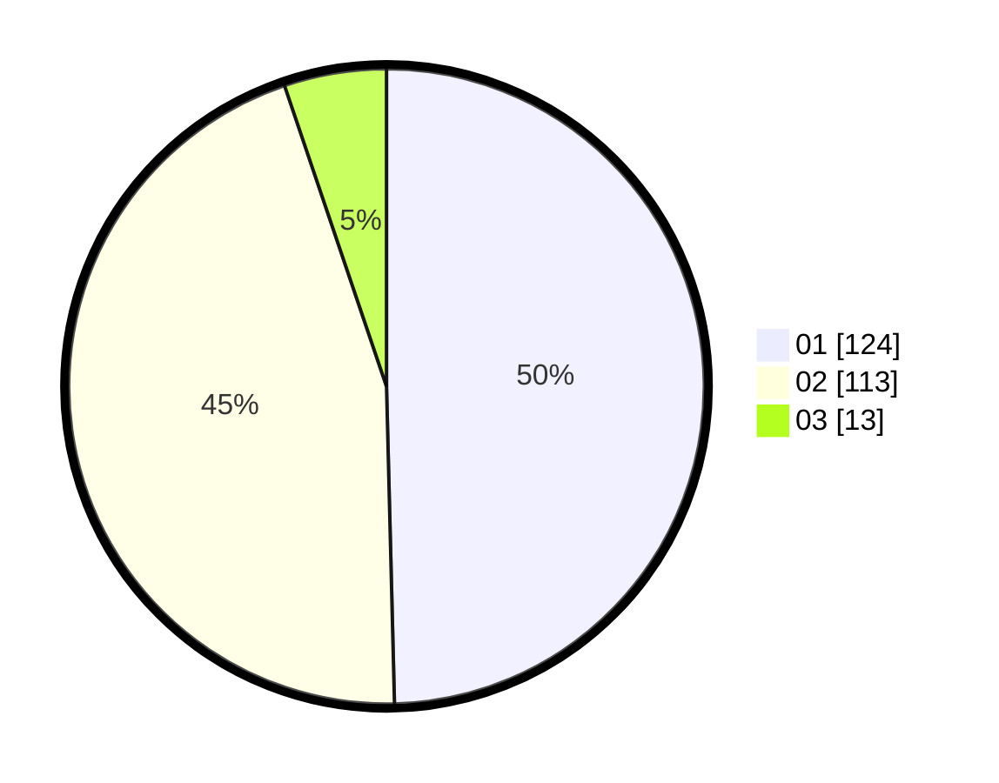

# Hasil

Hasil perolehan suara paslon dapat dilihat pada file paslon-01.txt, paslon-02.txt, dan paslon-03.txt.

Jika tidak ada, artinya data tersebut belum ada pada SIREKAP.

## Perolehan Suara

 * Paslon 01: **124**.
 * Paslon 02: **113**.
 * Paslon 03: **13**.

## Foto C Plano

https://sirekap-obj-formc.kpu.go.id/d2aa/pemilu/ppwp/31/75/10/10/01/3175101001075-20240214-155810--7dad1781-06ad-4cea-8b7f-aa9e8071cf8c.jpg

https://sirekap-obj-formc.kpu.go.id/d2aa/pemilu/ppwp/31/75/10/10/01/3175101001075-20240214-155659--cb8f89b6-3089-4e3e-b190-0f8adb79f5cd.jpg

https://sirekap-obj-formc.kpu.go.id/d2aa/pemilu/ppwp/31/75/10/10/01/3175101001075-20240214-162235--6af4d34e-8444-4e67-a50e-060cde906f98.jpg

## DATA PEMILIH TETAP

Jumlah pemilih dalam DPT: **278**.
 * L: **121**.
 * P: **157**.

## DATA PENGGUNA HAK PILIH

Jumlah pengguna hak pilih dalam DPT: **236**.
 * L: **101**.
 * P: **135**.

Jumlah pengguna hak pilih dalam DPTb: **10**.
 * L: **2**.
 * P: **8**.

Jumlah pengguna hak pilih dalam DPK: **6**.
 * L: **1**.
 * P: **5**.

Jumlah pengguna hak pilih: **252**.
 * L: **104**.
 * P: **148**.

## JUMLAH SUARA SAH DAN TIDAK SAH

JUMLAH SELURUH SUARA SAH: **250**.

JUMLAH SUARA TIDAK SAH: **2**.

JUMLAH SELURUH SUARA SAH DAN SUARA TIDAK SAH: **252**.
