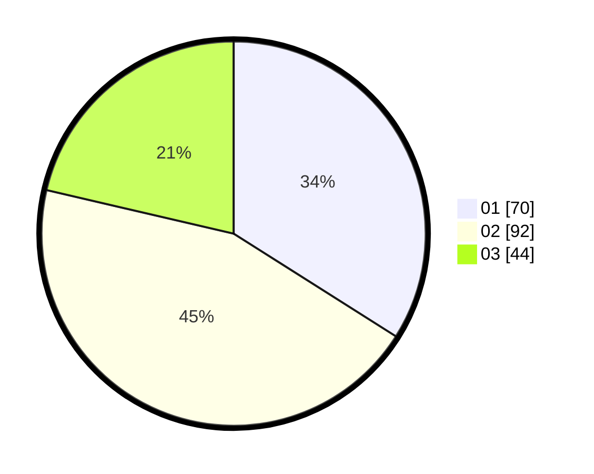

# Hasil

Hasil perolehan suara paslon dapat dilihat pada file paslon-01.txt, paslon-02.txt, dan paslon-03.txt.

Jika tidak ada, artinya data tersebut belum ada pada SIREKAP.

## Perolehan Suara

 * Paslon 01: **70**.
 * Paslon 02: **92**.
 * Paslon 03: **44**.

## Foto C Plano

https://sirekap-obj-formc.kpu.go.id/04b9/pemilu/ppwp/31/75/10/10/01/3175101001085-20240214-155457--64c04a4c-f02a-4c97-baf9-652c3be753ca.jpg

https://sirekap-obj-formc.kpu.go.id/04b9/pemilu/ppwp/31/75/10/10/01/3175101001085-20240214-155623--7a8dcb88-f0ce-4f72-9300-fc6058696024.jpg

https://sirekap-obj-formc.kpu.go.id/04b9/pemilu/ppwp/31/75/10/10/01/3175101001085-20240214-155038--a2e6f712-f0d4-4b18-ae22-1ed7b280c758.jpg
