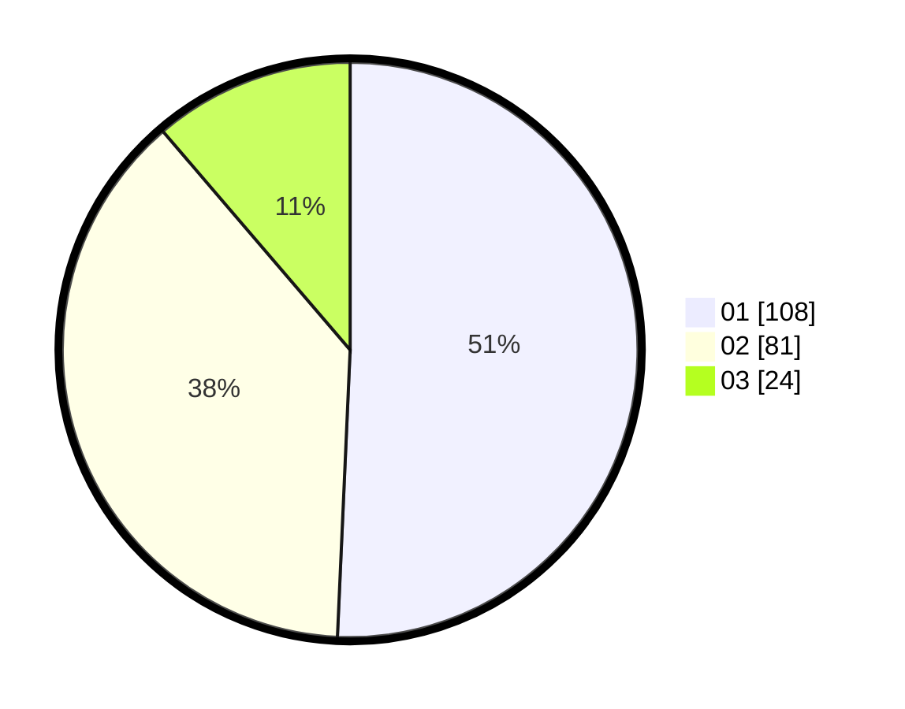

# Hasil

Hasil perolehan suara paslon dapat dilihat pada file paslon-01.txt, paslon-02.txt, dan paslon-03.txt.

Jika tidak ada, artinya data tersebut belum ada pada SIREKAP.

## Perolehan Suara

 * Paslon 01: **108**.
 * Paslon 02: **81**.
 * Paslon 03: **24**.

## Foto C Plano

https://sirekap-obj-formc.kpu.go.id/f678/pemilu/ppwp/31/75/10/10/01/3175101001088-20240214-234649--02246337-b157-4725-9a9d-a5fc0d3c83f4.jpg

https://sirekap-obj-formc.kpu.go.id/f678/pemilu/ppwp/31/75/10/10/01/3175101001088-20240214-234819--f11da32f-220e-416c-9f2f-395e6f90cc00.jpg

https://sirekap-obj-formc.kpu.go.id/f678/pemilu/ppwp/31/75/10/10/01/3175101001088-20240214-235020--a011166c-81d0-4315-9747-9549a5b63867.jpg

## DATA PEMILIH TETAP

Jumlah pemilih dalam DPT: **266**.
 * L: **138**.
 * P: **128**.

## DATA PENGGUNA HAK PILIH

Jumlah pengguna hak pilih dalam DPT: **210**.
 * L: **103**.
 * P: **107**.

Jumlah pengguna hak pilih dalam DPTb: **2**.
 * L: **1**.
 * P: **1**.

Jumlah pengguna hak pilih dalam DPK: **3**.
 * L: **1**.
 * P: **2**.

Jumlah pengguna hak pilih: **215**.
 * L: **105**.
 * P: **110**.

## JUMLAH SUARA SAH DAN TIDAK SAH

JUMLAH SELURUH SUARA SAH: **213**.

JUMLAH SUARA TIDAK SAH: **2**.

JUMLAH SELURUH SUARA SAH DAN SUARA TIDAK SAH: **215**.
