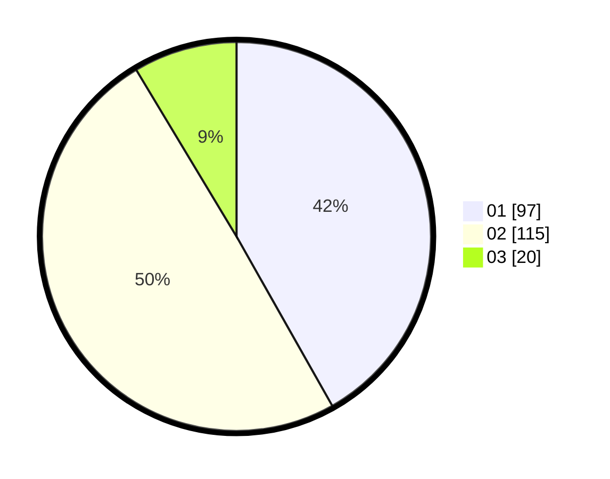

# Hasil

Hasil perolehan suara paslon dapat dilihat pada file paslon-01.txt, paslon-02.txt, dan paslon-03.txt.

Jika tidak ada, artinya data tersebut belum ada pada SIREKAP.

## Perolehan Suara

 * Paslon 01: **97**.
 * Paslon 02: **115**.
 * Paslon 03: **20**.

## Foto C Plano

https://sirekap-obj-formc.kpu.go.id/95c6/pemilu/ppwp/31/75/10/10/02/3175101002003-20240214-214231--ffac26b3-4685-4f6e-9072-e3994a8b2c48.jpg

https://sirekap-obj-formc.kpu.go.id/95c6/pemilu/ppwp/31/75/10/10/02/3175101002003-20240214-213706--9b4037e9-429e-403d-89ee-23265467c217.jpg

https://sirekap-obj-formc.kpu.go.id/95c6/pemilu/ppwp/31/75/10/10/02/3175101002003-20240214-221325--de9a06f5-b097-4798-81e5-3828617f7106.jpg
