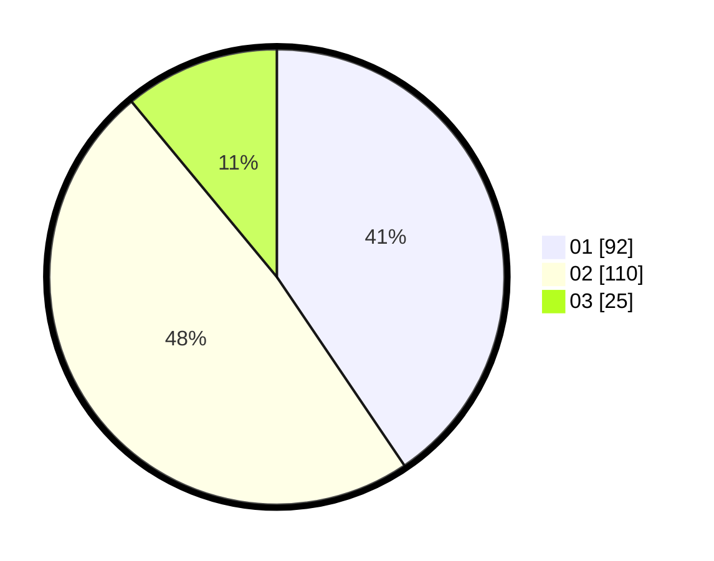

# Hasil

Hasil perolehan suara paslon dapat dilihat pada file paslon-01.txt, paslon-02.txt, dan paslon-03.txt.

Jika tidak ada, artinya data tersebut belum ada pada SIREKAP.

## Perolehan Suara

 * Paslon 01: **92**.
 * Paslon 02: **110**.
 * Paslon 03: **25**.

## Foto C Plano

https://sirekap-obj-formc.kpu.go.id/be31/pemilu/ppwp/31/75/10/10/02/3175101002006-20240215-172724--a1e5bfdf-f6b8-4fd0-937e-61f1e24ceedd.jpg

https://sirekap-obj-formc.kpu.go.id/be31/pemilu/ppwp/31/75/10/10/02/3175101002006-20240215-172746--6d549a4d-999e-45ef-9a64-3da09a9049e6.jpg

https://sirekap-obj-formc.kpu.go.id/be31/pemilu/ppwp/31/75/10/10/02/3175101002006-20240215-172735--d5128714-64cc-4295-b89b-248907242829.jpg

## DATA PEMILIH TETAP

Jumlah pemilih dalam DPT: **0**.
 * L: **0**.
 * P: **0**.

## DATA PENGGUNA HAK PILIH

Jumlah pengguna hak pilih dalam DPT: **0**.
 * L: **0**.
 * P: **0**.

Jumlah pengguna hak pilih dalam DPTb: **0**.
 * L: **0**.
 * P: **0**.

Jumlah pengguna hak pilih dalam DPK: **0**.
 * L: **0**.
 * P: **0**.

Jumlah pengguna hak pilih: **0**.
 * L: **0**.
 * P: **0**.

## JUMLAH SUARA SAH DAN TIDAK SAH

JUMLAH SELURUH SUARA SAH: **227**.

JUMLAH SUARA TIDAK SAH: **3**.

JUMLAH SELURUH SUARA SAH DAN SUARA TIDAK SAH: **230**.
