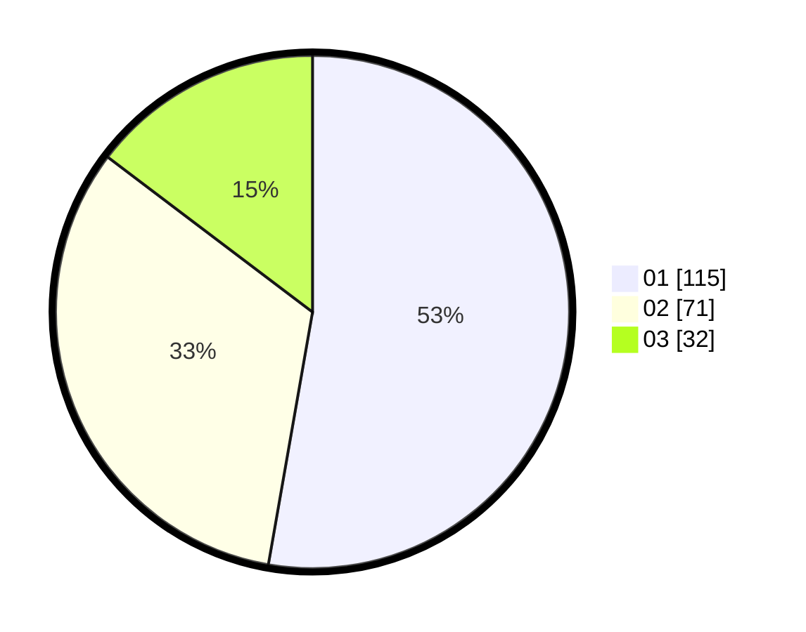

# Hasil

Hasil perolehan suara paslon dapat dilihat pada file paslon-01.txt, paslon-02.txt, dan paslon-03.txt.

Jika tidak ada, artinya data tersebut belum ada pada SIREKAP.

## Perolehan Suara

 * Paslon 01: **115**.
 * Paslon 02: **71**.
 * Paslon 03: **32**.

## Foto C Plano

https://sirekap-obj-formc.kpu.go.id/c52b/pemilu/ppwp/31/75/10/10/02/3175101002024-20240214-224040--63580e19-1212-4fdb-97a3-cab523868295.jpg

https://sirekap-obj-formc.kpu.go.id/c52b/pemilu/ppwp/31/75/10/10/02/3175101002024-20240214-224119--6cb88582-b068-4e0e-b0bb-e4e5b50b6079.jpg

https://sirekap-obj-formc.kpu.go.id/c52b/pemilu/ppwp/31/75/10/10/02/3175101002024-20240214-224143--b2c1678b-3aef-419a-aec7-c8f9a37811d4.jpg
