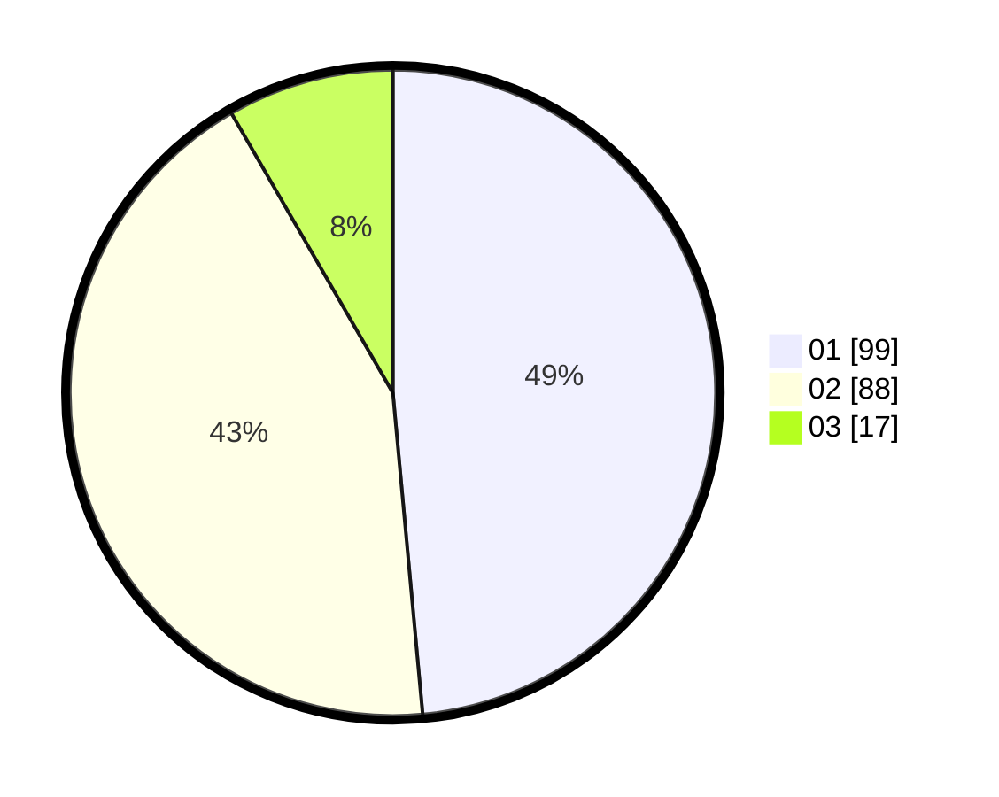

# Hasil

Hasil perolehan suara paslon dapat dilihat pada file paslon-01.txt, paslon-02.txt, dan paslon-03.txt.

Jika tidak ada, artinya data tersebut belum ada pada SIREKAP.

## Perolehan Suara

 * Paslon 01: **99**.
 * Paslon 02: **88**.
 * Paslon 03: **17**.

## Foto C Plano

https://sirekap-obj-formc.kpu.go.id/e7de/pemilu/ppwp/31/75/10/10/02/3175101002029-20240214-194447--67db87e2-0521-43d7-994b-f918c5cd31bf.jpg

https://sirekap-obj-formc.kpu.go.id/e7de/pemilu/ppwp/31/75/10/10/02/3175101002029-20240216-162643--0df6c0d6-fdf0-403f-874c-3cd9588b6b23.jpg

https://sirekap-obj-formc.kpu.go.id/e7de/pemilu/ppwp/31/75/10/10/02/3175101002029-20240214-194506--0ce2e8b6-d02c-4edb-98ab-e5fe1996c0bc.jpg

## DATA PEMILIH TETAP

Jumlah pemilih dalam DPT: **268**.
 * L: **131**.
 * P: **137**.

## DATA PENGGUNA HAK PILIH

Jumlah pengguna hak pilih dalam DPT: **199**.
 * L: **92**.
 * P: **107**.

Jumlah pengguna hak pilih dalam DPTb: **1**.
 * L: **1**.
 * P: **0**.

Jumlah pengguna hak pilih dalam DPK: **6**.
 * L: **3**.
 * P: **3**.

Jumlah pengguna hak pilih: **206**.
 * L: **96**.
 * P: **110**.

## JUMLAH SUARA SAH DAN TIDAK SAH

JUMLAH SELURUH SUARA SAH: **204**.

JUMLAH SUARA TIDAK SAH: **2**.

JUMLAH SELURUH SUARA SAH DAN SUARA TIDAK SAH: **206**.
