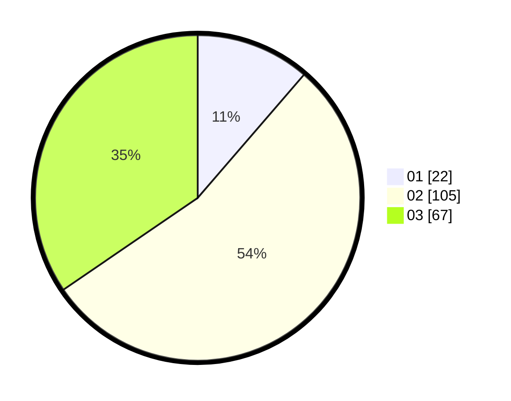

# Hasil

Hasil perolehan suara paslon dapat dilihat pada file paslon-01.txt, paslon-02.txt, dan paslon-03.txt.

Jika tidak ada, artinya data tersebut belum ada pada SIREKAP.

## Perolehan Suara

 * Paslon 01: **22**.
 * Paslon 02: **105**.
 * Paslon 03: **67**.

## Foto C Plano

https://sirekap-obj-formc.kpu.go.id/e374/pemilu/ppwp/31/75/10/10/02/3175101002030-20240215-223712--045ec6a2-e72a-4afc-ab95-7602cc2f300f.jpg

https://sirekap-obj-formc.kpu.go.id/e374/pemilu/ppwp/31/75/10/10/02/3175101002030-20240215-223715--f6b1ceff-1e40-433f-a3ca-760b4997f657.jpg

https://sirekap-obj-formc.kpu.go.id/e374/pemilu/ppwp/31/75/10/10/02/3175101002030-20240215-223713--1f1ead33-975e-4b6b-9293-75bf452ee508.jpg

## DATA PEMILIH TETAP

Jumlah pemilih dalam DPT: **256**.
 * L: **124**.
 * P: **132**.

## DATA PENGGUNA HAK PILIH

Jumlah pengguna hak pilih dalam DPT: **188**.
 * L: **85**.
 * P: **103**.

Jumlah pengguna hak pilih dalam DPTb: **3**.
 * L: **1**.
 * P: **2**.

Jumlah pengguna hak pilih dalam DPK: **4**.
 * L: **1**.
 * P: **3**.

Jumlah pengguna hak pilih: **195**.
 * L: **87**.
 * P: **108**.

## JUMLAH SUARA SAH DAN TIDAK SAH

JUMLAH SELURUH SUARA SAH: **194**.

JUMLAH SUARA TIDAK SAH: **1**.

JUMLAH SELURUH SUARA SAH DAN SUARA TIDAK SAH: **195**.
