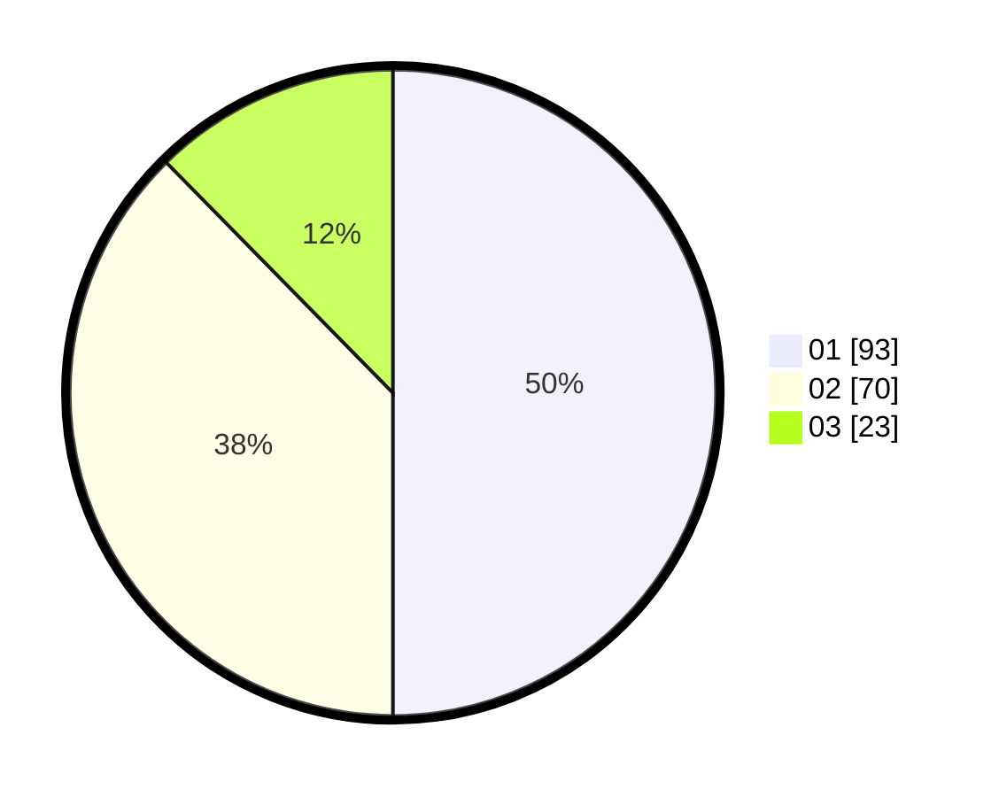

# Hasil

Hasil perolehan suara paslon dapat dilihat pada file paslon-01.txt, paslon-02.txt, dan paslon-03.txt.

Jika tidak ada, artinya data tersebut belum ada pada SIREKAP.

## Perolehan Suara

 * Paslon 01: **93**.
 * Paslon 02: **70**.
 * Paslon 03: **23**.

## Foto C Plano

https://sirekap-obj-formc.kpu.go.id/2db9/pemilu/ppwp/31/75/10/10/02/3175101002037-20240216-065707--22a7d5e4-0391-455f-8ccc-dfd2a1e37df0.jpg

https://sirekap-obj-formc.kpu.go.id/2db9/pemilu/ppwp/31/75/10/10/02/3175101002037-20240216-065709--d4dedd65-9105-45d5-a054-7a55a859026c.jpg

https://sirekap-obj-formc.kpu.go.id/2db9/pemilu/ppwp/31/75/10/10/02/3175101002037-20240216-065708--9ec450f0-7538-4f0d-b9de-be6a5e8b03b0.jpg

## DATA PEMILIH TETAP

Jumlah pemilih dalam DPT: **188**.
 * L: **83**.
 * P: **105**.

## DATA PENGGUNA HAK PILIH

Jumlah pengguna hak pilih dalam DPT: **187**.
 * L: **83**.
 * P: **104**.

Jumlah pengguna hak pilih dalam DPTb: **1**.
 * L: **0**.
 * P: **1**.

Jumlah pengguna hak pilih dalam DPK: **0**.
 * L: **0**.
 * P: **0**.

Jumlah pengguna hak pilih: **188**.
 * L: **83**.
 * P: **105**.

## JUMLAH SUARA SAH DAN TIDAK SAH

JUMLAH SELURUH SUARA SAH: **186**.

JUMLAH SUARA TIDAK SAH: **2**.

JUMLAH SELURUH SUARA SAH DAN SUARA TIDAK SAH: **188**.
