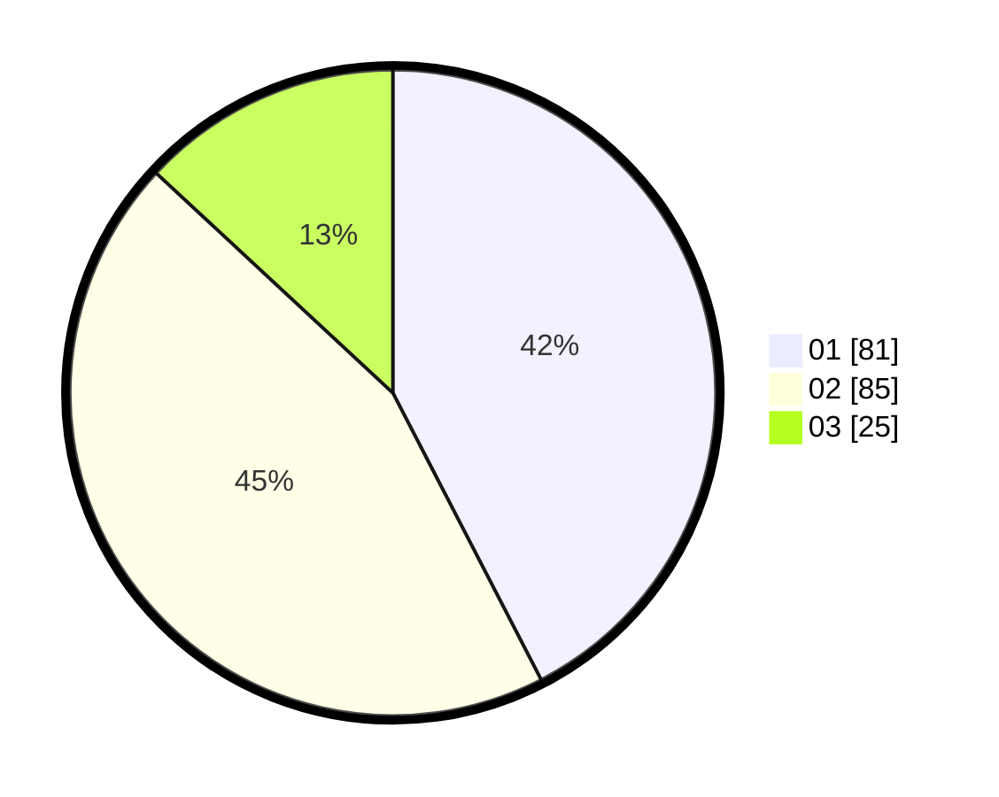

# Hasil

Hasil perolehan suara paslon dapat dilihat pada file paslon-01.txt, paslon-02.txt, dan paslon-03.txt.

Jika tidak ada, artinya data tersebut belum ada pada SIREKAP.

## Perolehan Suara

 * Paslon 01: **81**.
 * Paslon 02: **85**.
 * Paslon 03: **25**.

## Foto C Plano

https://sirekap-obj-formc.kpu.go.id/a762/pemilu/ppwp/31/75/10/10/02/3175101002040-20240214-211343--1850e544-d9cf-49fb-9619-494d52fddea0.jpg

https://sirekap-obj-formc.kpu.go.id/a762/pemilu/ppwp/31/75/10/10/02/3175101002040-20240214-202143--3583a8fe-39d9-424c-a18d-a2dfe2d9489c.jpg

https://sirekap-obj-formc.kpu.go.id/a762/pemilu/ppwp/31/75/10/10/02/3175101002040-20240214-202236--9be397a2-4b01-4bb5-84d3-95a6b271959c.jpg

## DATA PEMILIH TETAP

Jumlah pemilih dalam DPT: **260**.
 * L: **125**.
 * P: **135**.

## DATA PENGGUNA HAK PILIH

Jumlah pengguna hak pilih dalam DPT: **185**.
 * L: **86**.
 * P: **99**.

Jumlah pengguna hak pilih dalam DPTb: **2**.
 * L: **2**.
 * P: **0**.

Jumlah pengguna hak pilih dalam DPK: **6**.
 * L: **3**.
 * P: **3**.

Jumlah pengguna hak pilih: **193**.
 * L: **91**.
 * P: **102**.

## JUMLAH SUARA SAH DAN TIDAK SAH

JUMLAH SELURUH SUARA SAH: **191**.

JUMLAH SUARA TIDAK SAH: **2**.

JUMLAH SELURUH SUARA SAH DAN SUARA TIDAK SAH: **193**.
