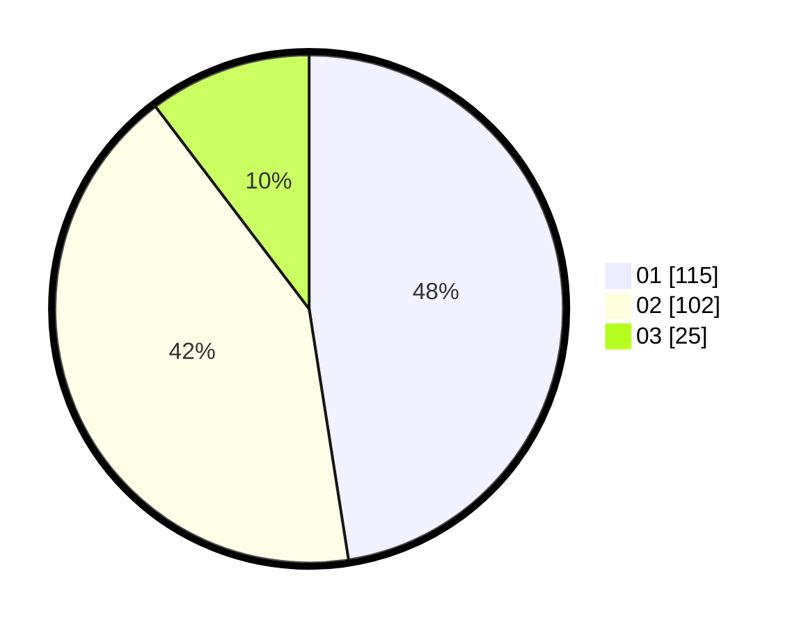

# Hasil

Hasil perolehan suara paslon dapat dilihat pada file paslon-01.txt, paslon-02.txt, dan paslon-03.txt.

Jika tidak ada, artinya data tersebut belum ada pada SIREKAP.

## Perolehan Suara

 * Paslon 01: **115**.
 * Paslon 02: **102**.
 * Paslon 03: **25**.

## Foto C Plano

https://sirekap-obj-formc.kpu.go.id/167f/pemilu/ppwp/31/75/10/10/02/3175101002054-20240215-213725--5556aaf6-b14b-4402-bd9f-6fe634074a9f.jpg

https://sirekap-obj-formc.kpu.go.id/167f/pemilu/ppwp/31/75/10/10/02/3175101002054-20240215-213727--0b291580-ac3e-4bd1-8397-2176b6b40ff5.jpg

https://sirekap-obj-formc.kpu.go.id/167f/pemilu/ppwp/31/75/10/10/02/3175101002054-20240215-213726--17916124-f82d-4ed5-a502-8ec7a0d91a32.jpg

## DATA PEMILIH TETAP

Jumlah pemilih dalam DPT: **284**.
 * L: **136**.
 * P: **148**.

## DATA PENGGUNA HAK PILIH

Jumlah pengguna hak pilih dalam DPT: **237**.
 * L: **112**.
 * P: **125**.

Jumlah pengguna hak pilih dalam DPTb: **4**.
 * L: **3**.
 * P: **1**.

Jumlah pengguna hak pilih dalam DPK: **5**.
 * L: **3**.
 * P: **2**.

Jumlah pengguna hak pilih: **246**.
 * L: **118**.
 * P: **128**.

## JUMLAH SUARA SAH DAN TIDAK SAH

JUMLAH SELURUH SUARA SAH: **242**.

JUMLAH SUARA TIDAK SAH: **4**.

JUMLAH SELURUH SUARA SAH DAN SUARA TIDAK SAH: **246**.
