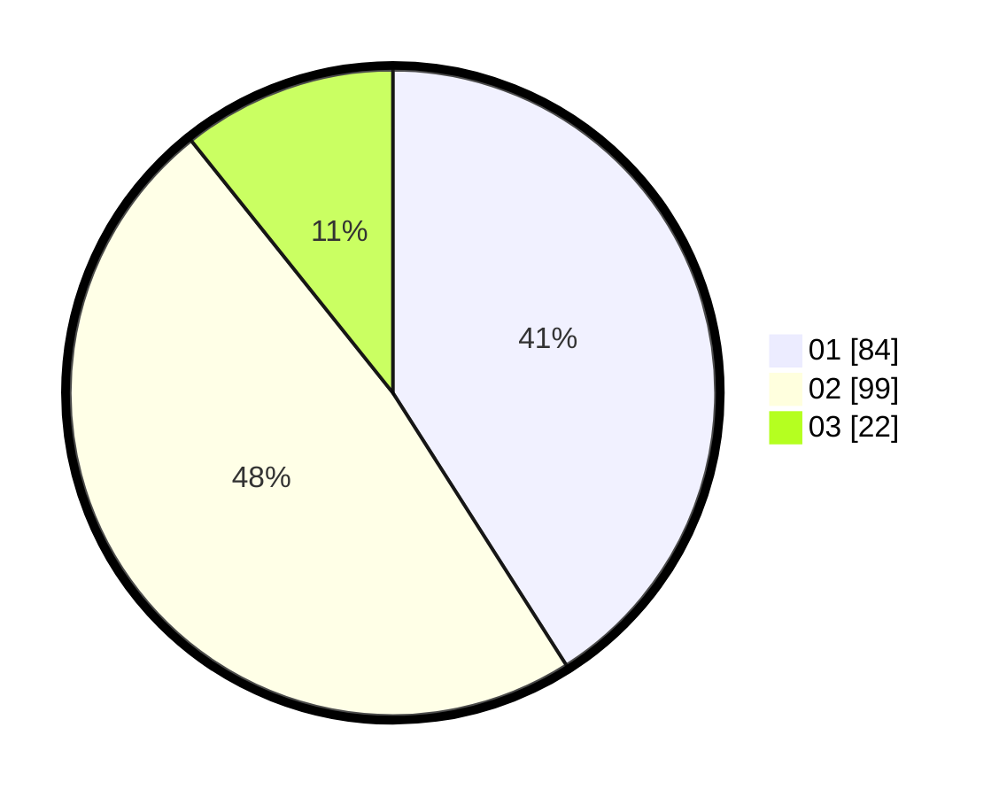

# Hasil

Hasil perolehan suara paslon dapat dilihat pada file paslon-01.txt, paslon-02.txt, dan paslon-03.txt.

Jika tidak ada, artinya data tersebut belum ada pada SIREKAP.

## Perolehan Suara

 * Paslon 01: **84**.
 * Paslon 02: **99**.
 * Paslon 03: **22**.

## Foto C Plano

https://sirekap-obj-formc.kpu.go.id/66c7/pemilu/ppwp/31/75/10/10/02/3175101002058-20240216-091930--00e44ff5-bda1-4637-a0a3-b6b4ce5a8bf5.jpg

https://sirekap-obj-formc.kpu.go.id/66c7/pemilu/ppwp/31/75/10/10/02/3175101002058-20240216-091933--a5fe94d9-42ee-4390-aee3-ee59660ce02d.jpg

https://sirekap-obj-formc.kpu.go.id/66c7/pemilu/ppwp/31/75/10/10/02/3175101002058-20240216-091931--17df447f-39c2-49fe-b37c-4de35da23557.jpg

## DATA PEMILIH TETAP

Jumlah pemilih dalam DPT: **260**.
 * L: **121**.
 * P: **139**.

## DATA PENGGUNA HAK PILIH

Jumlah pengguna hak pilih dalam DPT: **202**.
 * L: **94**.
 * P: **108**.

Jumlah pengguna hak pilih dalam DPTb: **2**.
 * L: **1**.
 * P: **1**.

Jumlah pengguna hak pilih dalam DPK: **3**.
 * L: **0**.
 * P: **3**.

Jumlah pengguna hak pilih: **207**.
 * L: **95**.
 * P: **112**.

## JUMLAH SUARA SAH DAN TIDAK SAH

JUMLAH SELURUH SUARA SAH: **205**.

JUMLAH SUARA TIDAK SAH: **2**.

JUMLAH SELURUH SUARA SAH DAN SUARA TIDAK SAH: **207**.
