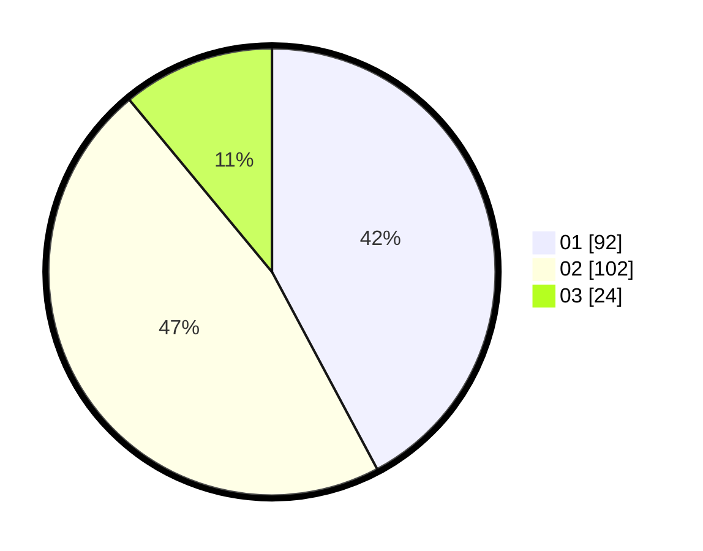

# Hasil

Hasil perolehan suara paslon dapat dilihat pada file paslon-01.txt, paslon-02.txt, dan paslon-03.txt.

Jika tidak ada, artinya data tersebut belum ada pada SIREKAP.

## Perolehan Suara

 * Paslon 01: **92**.
 * Paslon 02: **102**.
 * Paslon 03: **24**.

## Foto C Plano

https://sirekap-obj-formc.kpu.go.id/a7d3/pemilu/ppwp/31/75/10/10/02/3175101002059-20240214-191514--a40b020a-0f2c-4bd6-bda1-03793739a5d5.jpg

https://sirekap-obj-formc.kpu.go.id/a7d3/pemilu/ppwp/31/75/10/10/02/3175101002059-20240214-200442--dbf7e87c-9168-4ee0-babf-17a9d7725591.jpg

https://sirekap-obj-formc.kpu.go.id/a7d3/pemilu/ppwp/31/75/10/10/02/3175101002059-20240214-205551--8c69e121-bba8-4578-966c-2aa1ee160a6c.jpg

## DATA PEMILIH TETAP

Jumlah pemilih dalam DPT: **289**.
 * L: **141**.
 * P: **148**.

## DATA PENGGUNA HAK PILIH

Jumlah pengguna hak pilih dalam DPT: **217**.
 * L: **96**.
 * P: **121**.

Jumlah pengguna hak pilih dalam DPTb: **2**.
 * L: **1**.
 * P: **1**.

Jumlah pengguna hak pilih dalam DPK: **2**.
 * L: **0**.
 * P: **2**.

Jumlah pengguna hak pilih: **221**.
 * L: **97**.
 * P: **124**.

## JUMLAH SUARA SAH DAN TIDAK SAH

JUMLAH SELURUH SUARA SAH: **198**.

JUMLAH SUARA TIDAK SAH: **3**.

JUMLAH SELURUH SUARA SAH DAN SUARA TIDAK SAH: **221**.
