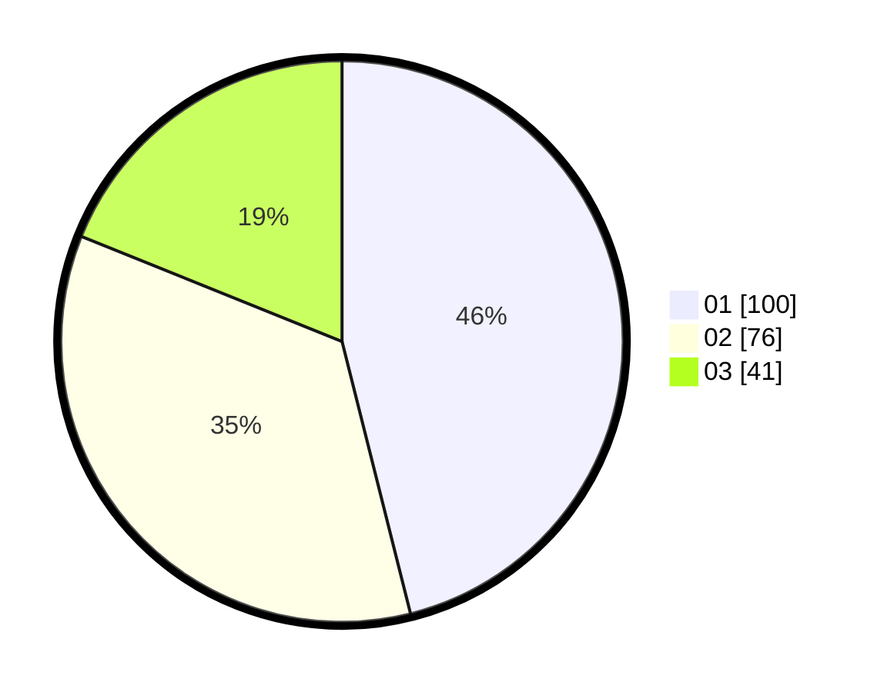

# Hasil

Hasil perolehan suara paslon dapat dilihat pada file paslon-01.txt, paslon-02.txt, dan paslon-03.txt.

Jika tidak ada, artinya data tersebut belum ada pada SIREKAP.

## Perolehan Suara

 * Paslon 01: **100**.
 * Paslon 02: **76**.
 * Paslon 03: **41**.

## Foto C Plano

https://sirekap-obj-formc.kpu.go.id/51a7/pemilu/ppwp/31/75/10/10/02/3175101002060-20240214-201438--5085a8e9-b4e1-4fb8-8473-a9f598306eee.jpg

https://sirekap-obj-formc.kpu.go.id/51a7/pemilu/ppwp/31/75/10/10/02/3175101002060-20240214-175327--b3e36cf2-2d15-4cea-9f26-d31992cc73d6.jpg

https://sirekap-obj-formc.kpu.go.id/51a7/pemilu/ppwp/31/75/10/10/02/3175101002060-20240214-175442--3e7dd552-73b0-4f23-9a89-4adcbd95a311.jpg

## DATA PEMILIH TETAP

Jumlah pemilih dalam DPT: **287**.
 * L: **137**.
 * P: **150**.

## DATA PENGGUNA HAK PILIH

Jumlah pengguna hak pilih dalam DPT: **214**.
 * L: **99**.
 * P: **115**.

Jumlah pengguna hak pilih dalam DPTb: **1**.
 * L: **1**.
 * P: **0**.

Jumlah pengguna hak pilih dalam DPK: **2**.
 * L: **1**.
 * P: **1**.

Jumlah pengguna hak pilih: **217**.
 * L: **101**.
 * P: **116**.

## JUMLAH SUARA SAH DAN TIDAK SAH

JUMLAH SELURUH SUARA SAH: **217**.

JUMLAH SUARA TIDAK SAH: **0**.

JUMLAH SELURUH SUARA SAH DAN SUARA TIDAK SAH: **217**.
