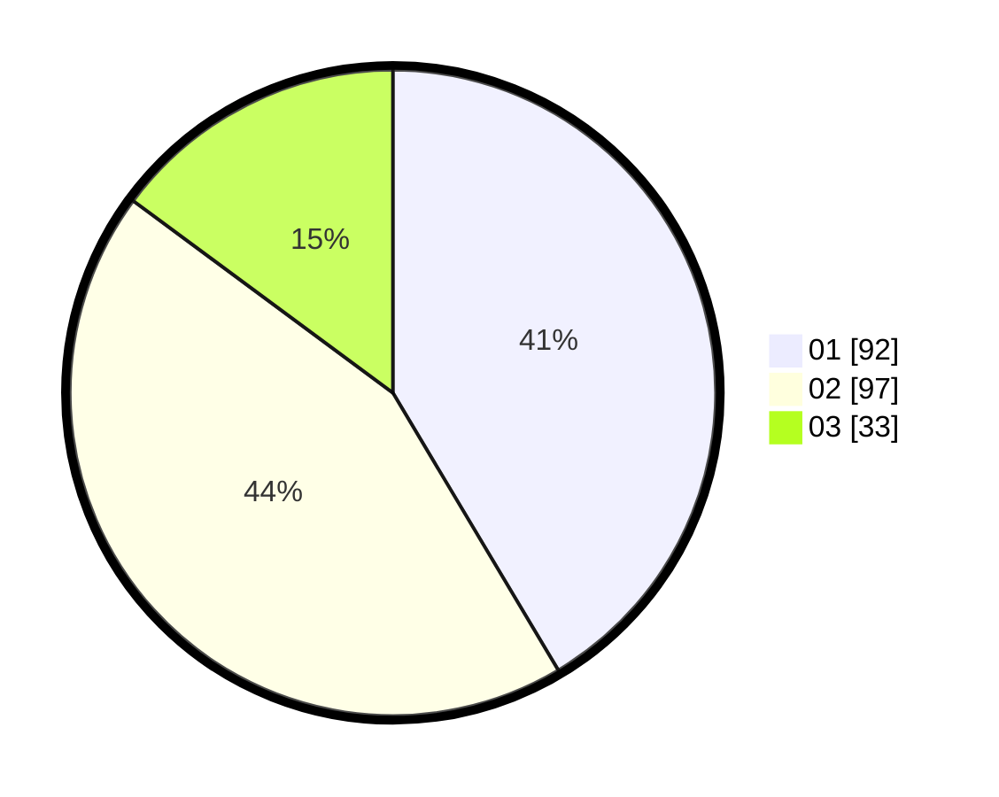

# Hasil

Hasil perolehan suara paslon dapat dilihat pada file paslon-01.txt, paslon-02.txt, dan paslon-03.txt.

Jika tidak ada, artinya data tersebut belum ada pada SIREKAP.

## Perolehan Suara

 * Paslon 01: **92**.
 * Paslon 02: **97**.
 * Paslon 03: **33**.

## Foto C Plano

https://sirekap-obj-formc.kpu.go.id/4849/pemilu/ppwp/31/75/10/10/02/3175101002062-20240215-204757--06bbe0fa-7d8c-479b-9d2f-18b60820a7f9.jpg

https://sirekap-obj-formc.kpu.go.id/4849/pemilu/ppwp/31/75/10/10/02/3175101002062-20240215-204759--b2f499cd-7f19-418c-9a38-e3d549d604fd.jpg

https://sirekap-obj-formc.kpu.go.id/4849/pemilu/ppwp/31/75/10/10/02/3175101002062-20240215-204757--fc7ad6d7-b30e-418c-9706-87b71925404f.jpg

## DATA PEMILIH TETAP

Jumlah pemilih dalam DPT: **289**.
 * L: **133**.
 * P: **156**.

## DATA PENGGUNA HAK PILIH

Jumlah pengguna hak pilih dalam DPT: **221**.
 * L: **81**.
 * P: **140**.

Jumlah pengguna hak pilih dalam DPTb: **0**.
 * L: **0**.
 * P: **0**.

Jumlah pengguna hak pilih dalam DPK: **6**.
 * L: **4**.
 * P: **2**.

Jumlah pengguna hak pilih: **227**.
 * L: **85**.
 * P: **142**.

## JUMLAH SUARA SAH DAN TIDAK SAH

JUMLAH SELURUH SUARA SAH: **222**.

JUMLAH SUARA TIDAK SAH: **5**.

JUMLAH SELURUH SUARA SAH DAN SUARA TIDAK SAH: **227**.
